# HGraber next

Это пятая итерация HGraber, которая не является обратно совместимой с предыдущими и создана с целью обработки большего количества данных более эффективным способом.

[Базовый агент](https://github.com/gbh007/hgraber-next-agent-core) для системы  
[UI на React TS](https://github.com/gbh007/hgraber-next-react-ui)  
[Вспомогательные инструменты](https://github.com/gbh007/hgraber-next-tools) для системы

Оглавление:

- [История проекта](#история-проекта)
- [Словарь терминов используемых в приложении](#словарь-терминов-используемых-в-приложении)
- [Схема взаимодействия](#схема-взаимодействия)
- [Пример настройка логов и метрик (Grafana stack)](#пример-настройка-логов-и-метрик-grafana-stack)
- [Пример настройки CD в Jenkins](#пример-настройки-cd-в-jenkins)
- [Дефолтная конфигурация и перекодировании конфигурации](#дефолтная-конфигурация-и-перекодировании-конфигурации)
- [Планы на следующую версию](#планы-на-следующую-версию)
- [Прошлые версии](#прошлые-версии)

## История проекта

_Да простит меня Sqlite_ 🙏

```mermaid
timeline
  section 2018
    Апрель : 🆙 проект "Manga graber"
  section 2021
    Июль : 🆙 CLI "Hgraber"
         : 📢 Веб интерфейс
    Ноябрь : 📢 Полноценная поддержка атрибутов
           : 🆙 Версия 1.0
  section 2022
    Январь : 🛠️ Переход на gin-gonic
           : 🛠️ 100% покрытие context
           : 🛠️ Новый формат логирования
           : 🆙 Версия 2.0
    Март : 🛠️ Добавлен make
         : 📦 Добавлена "JDB"
         : 🛠️ Переход на net/http сервер
         : 🗑️ Удаление поддержки sqlite
         : 🆙 Версия 3.0
         : 🛠️ Добавление build info
         : 📢 "Плавающие окна" на UI
         : 📢 Система оценок
  section 2023
    Июль : 📢 Добавление авторизации
         : 🔩 "Глубокий рефакторинг" 😳 d7d25a5b9f
    Сентябрь : 🔧 Переработка парсинга атрибутов
             : 📦 Возврат sqlite
             : 🪛 Утилита конвертации БД
             : 📝 Добавлен README
             : 📢 Режим хранения в ОЗУ
             : 📢 Мониторинг воркеров
             : 🛠️ ReactJS
    Октябрь : 📦 Поддержка PostgreSQL
    Декабрь : 🗑️ Удален ReactJS
            : 📢 Множественная загрузка
            : 📝 Планы на версию 4
            : 📢 Внешняя файловая система
            : 🗑️ Удаление поддержки sqlite (снова)
            : ⬡ Переход на гексагональную архитектуру
            : 📢 Экспорт книг воркером
            : 🐋 Докер и локальный запуск
            : 📢 Появление системы агентов
            : 🆙 Flutter UI
  section 2024
    Январь : 🛠️ Рефакторинг API и названий
           : 🛠️ Миграции в "JDB"
           : 🆙 Версия 4.0
    Март : 🛠️ Переход на log/slog
         : 📢 Размер страниц
         : 📝 Планы на версию 5
         : 🪛 Утилиты для исправления дат в БД
         : 🪛 Утилиты поиска копий данных
    Июнь : 🛠️ API для экспорта в 5-ю версию
         : 🪛 Мигратор в 5 версию
         : 🆙 Kotlin UI
         : 🆙 Начало работ над HGnext
         : 📢 Система меток
         : 🛠️ Переход на VueJS
         : 🗑️ Удаление системы рейтингов
         : 📢 Экспорт книг в агента
    Июль : 📢 Дедупликация файлов
         : 📢 Борда Grafana
         : 🆙 Agent-fs
         : 📢 Файловая система на агенте
         : 🛠️ OpenTelemetry
         : 🛠️ Конфигурация через yaml
         : 📢 Скачивание архивов из веб интерфейса
         : 📢 Список включенных парсеров
         : 🛠️ Отладочный инструмент для скачивания архивов агентом
         : ☠️ Прекращение поддержки Kotlin UI
    Август : 📢 Сервер как кеш-агент
           : 📢 Оригинальные атрибуты
           : 📢 Удаление и верификация книг
           : 📢 Фильтрация книг
           : 📢 Множественный парсинг (каталоги)
           : 📢 Экспорт данных между серверами
           : 🛠️ Коррекция обработки редиректов в агенте
    Сентябрь : 📢 Поиск книг по архиву
             : 📢 Сканирование экспортированных файлов в agent-fs
             : 📢 Дедупликация экспорта в agent-fs
    Октябрь : 🆙 React UI
    Декабрь : 📢 Фильтрация по атрибутам
            : 📢 Пресеты меток
            : 📢 Фильтрация по меткам
            : 📢 Поиск дубликатов по страницам
            : 🛠️ Система длительных задач
            : 🗑️ Удаление VueJS
            : 📢 Информация о размерах книги
            : 📢 Сравнение книг
  section 2025
    Январь : 📢 Уникальные страницы в книге
           : 📢 Поиск книг по странице
           : 📢 Редактор книги
           : 📢 Ребилдер книги
           : 📢 Мертвые хеши
           : 📢 Цвета атрибутов
           : 📢 Быстрая фильтрация по атрибутам
           : 📢 Темная тема
           : 📢 Highway
           : 🆙 Версия next 0.0
           : 🆙 Agent core
           : ☠️ Прекращение поддержки agent-fs
    Февраль : 📢 Множественные файловые системы
            : 📢 Изменение порядка страниц в ребилдере
            : 🛠️ Рефакторинг модуля веб сервера
            : 🛠️ Генерации борды Grafana через jsonnet
            : 📢 Зеркала сайтов
            : 🗑️ Отказ от sqlx
            : 🆙 Версия next 1.0
            : 🪛 Утилита загрузки архивов в систему
            : 🛠️ Отладочный сервер в agent core
            : 🛠️ Pyroscope
    Март : 📢 Ремапинг атрибутов
         : 📢 Цветные атрибуты в списке книг
         : 📢 Прокрутка наверх при просмотре страниц
         : 🛠️ Кеширование запросов парсинга в agent core
    Апрель : 📢 HProxy
    Май : 📢 Компоновка позиций выбранных страниц в ребилдере
    Август : 📢 Массовые загрузки
           : 🛠️ Пересмотр линтеров на проекте
           : 🛠️ Рефакторинг модуля репозитория
           : 📢 Лимиты для HProxy
           : 🛠️ Рефакторинг архитектуры React UI
    Сентябрь : 🛠️ Конфигурация через toml
             : 🛠️ Генерации борды Grafana через go-sdk
             : 📢 Сокрытие выбранных страниц в ребилдере
             : 🗑️ Отказ от jsonnet
```



## Словарь терминов используемых в приложении

| В коде    | Слово             | Значение                                                                                 | Примечание                                                    |
| --------- | ----------------- | ---------------------------------------------------------------------------------------- | ------------------------------------------------------------- |
| book      | Книга             | Минимальная структурированная единица данных в системе состоящая из страниц              |                                                               |
| agent     | Агент             | Система для первичной обработки и загрузки данных                                        |                                                               |
| page      | Страница          | Изображение и дополнительная информация связанная с ним                                  |                                                               |
| attribute | Атрибут           | Данные книги, для фильтрации (например автор)                                            |                                                               |
| label     | Метка             | Некая мета-информация о книге или ее странице                                            | всегда имеет вид пары ключ значение                           |
| deadHash  | Мертвый хеш       | Хеши файлов которые не представляют интереса для обработки и хранения                    |                                                               |
| fs        | Файловая система  | Система для хранения файлов                                                              | Может быть как на агенте, так и на локальной файловой системе |
| highway   | Хайвей            | Способ получать данные напрямую с файловых агентов, без дополнительного проксирования    |                                                               |
| mirror    | Зеркало           | Дополнительный адрес для парсинга, совокупность адресов используется для проверки дублей | Ранее система проверки дублей по зеркалам была частью агента  |
| hproxy    | Проброс сайта     | Способ просматривать сайты для парсинга напрямую в hgraber                               |                                                               |
| massload  | Массовая загрузка | Функционал для работы с массовыми закачками и их мапингом на атрибуты                    |                                                               |

## Схема взаимодействия


На схеме изображено:

- 2 мастер системы A и B (важно, hgnext не имеет мультимастера)
  - Системы могут выгружать в друг друга данные и использовать друг друга как кеш (не будет похода в парсер)
  - Система A
    - Имеет локальную файловую систему A
    - Файловую систему через агента B
    - Базу данных A
  - Система B
    - Файловую систему через агента C
    - Базу данных B
- 3 Агента A, B, C
  - Агент A
    - Имеет локальную файловую систему B
    - Умеет парсить сайт A
    - Поддерживает экспорт
  - Агент B
    - Умеет парсить сайт B и C
  - Агент C
    - Имеет локальную файловую систему C
    - Умеет парсить сайт D и E

## Пример настройка логов и метрик (Grafana stack)

Генерация борды с кастомной конфигурацией:

1. Скопировать файл `config-dashboard-example.toml` в `config-dashboard.toml`
2. Изменить настройки `config-dashboard.toml` на нужные
3. Запустить генерацию `make grafana`

Docker compose

```yaml
services:
  main:
    container_name: hgraber-next-main
    logging:
      driver: loki
      options:
        loki-url: "http://localhost:3100/loki/api/v1/push"
```

Prometheus

```yaml
scrape_configs:
  - job_name: hgraber-next
    static_configs:
      - targets:
          - localhost:8080
        labels:
          service_name: hgraber-next-main
```

Promtail

```yaml
scrape_configs:
  - job_name: hgraber-next
    static_configs:
      - targets:
          - localhost
        labels:
          job: hgraber-next
          __path__: <path to logs>
          service_name: hgraber-next-main
```

## Пример настройки CD в Jenkins

В данном примере приведен пример пайплайна, не рекомендуется его использовать как готовый

```bash
export PATH=$PATH:/usr/local/go/bin:$HOME/go/bin
bash build.bash

docker build --build-arg "BINARY_PATH=_build/server-linux-amd64" -t hgraber-next-server:latest .
docker compose -f "${DC_PATH}/docker-compose.yml" up -d --remove-orphans

go run cmd/grafanagenerator/main.go --config "${DC_PATH}/dashboard.toml"
```

## Дефолтная конфигурация и перекодировании конфигурации

Для этого есть специальная утилита `configremaper`

**Важно:** могут быть нюансы с переносом в env формат

Для ее сборки

> go build -o ./bin/build/configremaper ./cmd/configremaper

Для генерации дефолтной конфигурации (поддерживается `.yaml`, `.yml`, `.toml`, `.env`)

> ./bin/build/configremaper --out config-generated.yaml

Для переноса конфига между форматами

> ./bin/build/configremaper -in config.yaml -out config.toml

## Планы на следующую версию

1. Исследование и улучшение дедупликации
2. Сокращение размеров и нагрузки на БД

## Прошлые версии

- HGraber (1-4) [Github](https://github.com/gbh007/hgraber)/[Gitlab](https://gitlab.com/gbh007/hgraber)

Отличия новой версии:

1. Изменения архитектуры БД с целью:
   - Уменьшения дублирования данных
2. Переход от PULL модели агентов к PUSH, для переноса основной логики в корневой сервер (включая логику зеркал сайтов)
3. Переход на "промышленные" библиотеки и стандарты
   - Примечание: изначально система писалась как более близкая к пользователю (логи вида plain text и т.п.) и максимально "чистая"
4. Фичи дедупликации и очистки ненужных данных
