# hgrabernext

## Tables

| Name | Columns | Comment | Type |
| ---- | ------- | ------- | ---- |
| [public.goose_db_version](public.goose_db_version.md) | 4 |  | BASE TABLE |
| [public.books](public.books.md) | 11 |  | BASE TABLE |
| [public.files](public.files.md) | 9 |  | BASE TABLE |
| [public.pages](public.pages.md) | 8 |  | BASE TABLE |
| [public.attributes](public.attributes.md) | 5 |  | BASE TABLE |
| [public.book_attributes](public.book_attributes.md) | 3 |  | BASE TABLE |
| [public.book_labels](public.book_labels.md) | 5 |  | BASE TABLE |
| [public.agents](public.agents.md) | 11 |  | BASE TABLE |
| [public.book_origin_attributes](public.book_origin_attributes.md) | 3 |  | BASE TABLE |
| [public.deleted_pages](public.deleted_pages.md) | 11 |  | BASE TABLE |
| [public.label_presets](public.label_presets.md) | 5 |  | BASE TABLE |
| [public.dead_hashes](public.dead_hashes.md) | 4 |  | BASE TABLE |
| [public.attribute_colors](public.attribute_colors.md) | 5 |  | BASE TABLE |
| [public.file_storages](public.file_storages.md) | 10 |  | BASE TABLE |
| [public.url_mirrors](public.url_mirrors.md) | 4 |  | BASE TABLE |
| [public.attribute_remaps](public.attribute_remaps.md) | 6 |  | BASE TABLE |
| [public.massloads](public.massloads.md) | 14 |  | BASE TABLE |
| [public.massload_external_links](public.massload_external_links.md) | 8 |  | BASE TABLE |
| [public.massload_attributes](public.massload_attributes.md) | 10 |  | BASE TABLE |
| [public.massload_flags](public.massload_flags.md) | 7 |  | BASE TABLE |

## Relations

```mermaid
erDiagram

"public.files" }o--|| "public.file_storages" : "FOREIGN KEY (fs_id) REFERENCES file_storages(id) ON UPDATE CASCADE ON DELETE CASCADE"
"public.pages" }o--|| "public.books" : "FOREIGN KEY (book_id) REFERENCES books(id) ON UPDATE CASCADE ON DELETE CASCADE"
"public.pages" }o--o| "public.files" : "FOREIGN KEY (file_id) REFERENCES files(id) ON UPDATE CASCADE ON DELETE SET NULL"
"public.book_attributes" }o--|| "public.books" : "FOREIGN KEY (book_id) REFERENCES books(id) ON UPDATE CASCADE ON DELETE CASCADE"
"public.book_attributes" }o--|| "public.attributes" : "FOREIGN KEY (attr) REFERENCES attributes(code) ON UPDATE CASCADE ON DELETE CASCADE"
"public.book_labels" }o--|| "public.books" : "FOREIGN KEY (book_id) REFERENCES books(id) ON UPDATE CASCADE ON DELETE CASCADE"
"public.book_origin_attributes" }o--|| "public.books" : "FOREIGN KEY (book_id) REFERENCES books(id) ON UPDATE CASCADE ON DELETE CASCADE"
"public.book_origin_attributes" }o--|| "public.attributes" : "FOREIGN KEY (attr) REFERENCES attributes(code) ON UPDATE CASCADE ON DELETE CASCADE"
"public.deleted_pages" }o--|| "public.books" : "FOREIGN KEY (book_id) REFERENCES books(id) ON UPDATE CASCADE ON DELETE CASCADE"
"public.attribute_colors" }o--|| "public.attributes" : "FOREIGN KEY (attr) REFERENCES attributes(code) ON UPDATE CASCADE ON DELETE CASCADE"
"public.file_storages" }o--o| "public.agents" : "FOREIGN KEY (agent_id) REFERENCES agents(id) ON UPDATE CASCADE ON DELETE SET NULL"
"public.attribute_remaps" }o--|| "public.attributes" : "FOREIGN KEY (attr) REFERENCES attributes(code) ON UPDATE CASCADE ON DELETE CASCADE"
"public.attribute_remaps" }o--o| "public.attributes" : "FOREIGN KEY (to_attr) REFERENCES attributes(code) ON UPDATE CASCADE ON DELETE CASCADE"
"public.massload_external_links" }o--|| "public.massloads" : "FOREIGN KEY (massload_id) REFERENCES massloads(id) ON UPDATE CASCADE ON DELETE CASCADE"
"public.massload_attributes" }o--|| "public.attributes" : "FOREIGN KEY (attr_code) REFERENCES attributes(code) ON UPDATE CASCADE ON DELETE CASCADE"
"public.massload_attributes" }o--|| "public.massloads" : "FOREIGN KEY (massload_id) REFERENCES massloads(id) ON UPDATE CASCADE ON DELETE CASCADE"

"public.goose_db_version" {
  integer id
  bigint version_id
  boolean is_applied
  timestamp_without_time_zone tstamp
}
"public.books" {
  uuid id
  text name
  text origin_url
  integer page_count
  boolean attributes_parsed
  timestamp_with_time_zone create_at
  boolean deleted
  timestamp_with_time_zone deleted_at
  boolean verified
  timestamp_with_time_zone verified_at
  boolean is_rebuild
}
"public.files" {
  uuid id
  text filename
  text ext
  text md5_sum
  text sha256_sum
  bigint size
  timestamp_with_time_zone create_at
  uuid fs_id FK
  boolean invalid_data
}
"public.pages" {
  uuid book_id FK
  integer page_number
  text ext
  text origin_url
  timestamp_with_time_zone create_at
  boolean downloaded
  timestamp_with_time_zone load_at
  uuid file_id FK
}
"public.attributes" {
  text code
  text name
  text plural_name
  integer order
  text description
}
"public.book_attributes" {
  uuid book_id FK
  text attr FK
  text value
}
"public.book_labels" {
  uuid book_id FK
  integer page_number
  text name
  text value
  timestamp_with_time_zone create_at
}
"public.agents" {
  uuid id
  text name
  text addr
  text token
  boolean can_parse
  boolean can_export
  integer priority
  timestamp_with_time_zone create_at
  boolean can_parse_multi
  boolean has_fs
  boolean has_hproxy
}
"public.book_origin_attributes" {
  uuid book_id FK
  text attr FK
  text__ values
}
"public.deleted_pages" {
  uuid book_id FK
  integer page_number
  text ext
  text origin_url
  text md5_sum
  text sha256_sum
  bigint size
  boolean downloaded
  timestamp_with_time_zone created_at
  timestamp_with_time_zone loaded_at
  timestamp_with_time_zone deleted_at
}
"public.label_presets" {
  text name
  text description
  text__ values
  timestamp_with_time_zone created_at
  timestamp_with_time_zone updated_at
}
"public.dead_hashes" {
  text md5_sum
  text sha256_sum
  bigint size
  timestamp_with_time_zone created_at
}
"public.attribute_colors" {
  text attr FK
  text value
  varchar_10_ text_color
  varchar_10_ background_color
  timestamp_with_time_zone created_at
}
"public.file_storages" {
  uuid id
  text name
  text description
  uuid agent_id FK
  text path
  integer download_priority
  integer deduplicate_priority
  boolean highway_enabled
  text highway_addr
  timestamp_with_time_zone created_at
}
"public.url_mirrors" {
  uuid id
  text name
  text__ prefixes
  text description
}
"public.attribute_remaps" {
  text attr FK
  text value
  text to_attr FK
  text to_value
  timestamp_with_time_zone created_at
  timestamp_with_time_zone updated_at
}
"public.massloads" {
  integer id
  text name
  text description
  bigint page_size
  bigint file_size
  timestamp_with_time_zone created_at
  timestamp_with_time_zone updated_at
  text__ flags
  bigint page_count
  bigint file_count
  bigint books_ahead
  bigint new_books
  bigint existing_books
  bigint books_in_system
}
"public.massload_external_links" {
  integer massload_id FK
  text url
  timestamp_with_time_zone created_at
  bigint books_ahead
  bigint new_books
  bigint existing_books
  boolean auto_check
  timestamp_with_time_zone updated_at
}
"public.massload_attributes" {
  integer massload_id FK
  text attr_code FK
  text attr_value
  bigint page_size
  bigint file_size
  timestamp_with_time_zone created_at
  timestamp_with_time_zone updated_at
  bigint page_count
  bigint file_count
  bigint books_in_system
}
"public.massload_flags" {
  text code
  text name
  text description
  timestamp_with_time_zone created_at
  integer order_weight
  varchar_10_ text_color
  varchar_10_ background_color
}
```

---

> Generated by [tbls](https://github.com/k1LoW/tbls)
