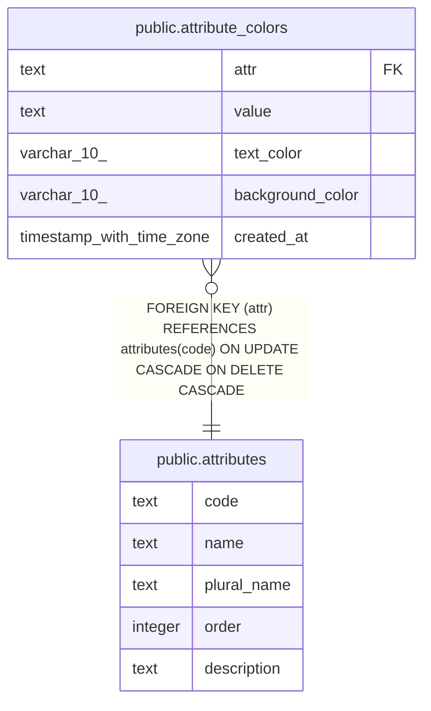

# public.attribute_colors

## Description

## Columns

| Name | Type | Default | Nullable | Children | Parents | Comment |
| ---- | ---- | ------- | -------- | -------- | ------- | ------- |
| attr | text |  | false |  | [public.attributes](public.attributes.md) |  |
| value | text |  | false |  |  |  |
| text_color | varchar(10) |  | false |  |  |  |
| background_color | varchar(10) |  | false |  |  |  |
| created_at | timestamp with time zone |  | false |  |  |  |

## Constraints

| Name | Type | Definition |
| ---- | ---- | ---------- |
| attribute_colors_attr_fkey | FOREIGN KEY | FOREIGN KEY (attr) REFERENCES attributes(code) ON UPDATE CASCADE ON DELETE CASCADE |
| attribute_colors_pkey | PRIMARY KEY | PRIMARY KEY (attr, value) |

## Indexes

| Name | Definition |
| ---- | ---------- |
| attribute_colors_pkey | CREATE UNIQUE INDEX attribute_colors_pkey ON public.attribute_colors USING btree (attr, value) |

## Relations

---

> Generated by [tbls](https://github.com/k1LoW/tbls)
