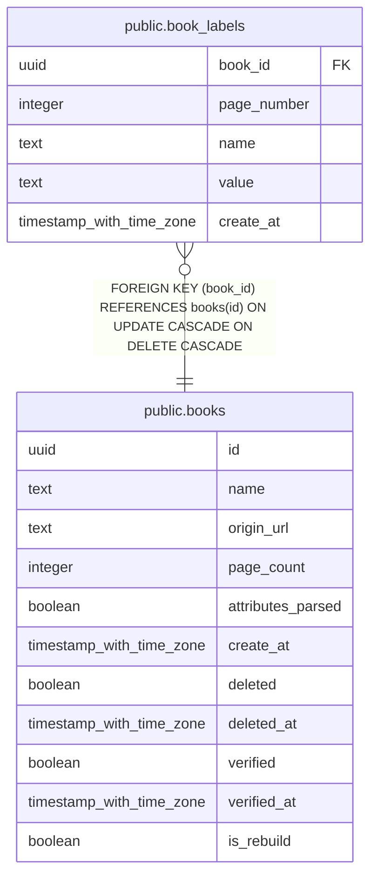

# public.book_labels

## Description

## Columns

| Name | Type | Default | Nullable | Children | Parents | Comment |
| ---- | ---- | ------- | -------- | -------- | ------- | ------- |
| book_id | uuid |  | false |  | [public.books](public.books.md) |  |
| page_number | integer |  | false |  |  |  |
| name | text |  | false |  |  |  |
| value | text |  | false |  |  |  |
| create_at | timestamp with time zone |  | false |  |  |  |

## Constraints

| Name | Type | Definition |
| ---- | ---- | ---------- |
| book_labels_book_id_fkey | FOREIGN KEY | FOREIGN KEY (book_id) REFERENCES books(id) ON UPDATE CASCADE ON DELETE CASCADE |
| book_labels_pkey | PRIMARY KEY | PRIMARY KEY (book_id, page_number, name) |

## Indexes

| Name | Definition |
| ---- | ---------- |
| book_labels_pkey | CREATE UNIQUE INDEX book_labels_pkey ON public.book_labels USING btree (book_id, page_number, name) |
| book_labels_value | CREATE INDEX book_labels_value ON public.book_labels USING hash (value) |

## Relations

---

> Generated by [tbls](https://github.com/k1LoW/tbls)
