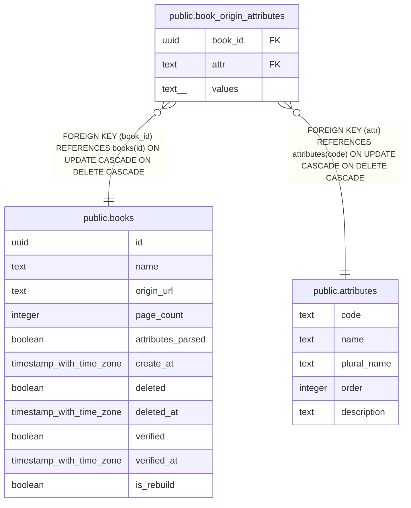

# public.book_origin_attributes

## Description

## Columns

| Name | Type | Default | Nullable | Children | Parents | Comment |
| ---- | ---- | ------- | -------- | -------- | ------- | ------- |
| book_id | uuid |  | false |  | [public.books](public.books.md) |  |
| attr | text |  | false |  | [public.attributes](public.attributes.md) |  |
| values | text[] |  | false |  |  |  |

## Constraints

| Name | Type | Definition |
| ---- | ---- | ---------- |
| book_origin_attributes_book_id_fkey | FOREIGN KEY | FOREIGN KEY (book_id) REFERENCES books(id) ON UPDATE CASCADE ON DELETE CASCADE |
| book_origin_attributes_attr_fkey | FOREIGN KEY | FOREIGN KEY (attr) REFERENCES attributes(code) ON UPDATE CASCADE ON DELETE CASCADE |
| book_origin_attributes_pkey | PRIMARY KEY | PRIMARY KEY (book_id, attr) |

## Indexes

| Name | Definition |
| ---- | ---------- |
| book_origin_attributes_pkey | CREATE UNIQUE INDEX book_origin_attributes_pkey ON public.book_origin_attributes USING btree (book_id, attr) |

## Relations

---

> Generated by [tbls](https://github.com/k1LoW/tbls)
