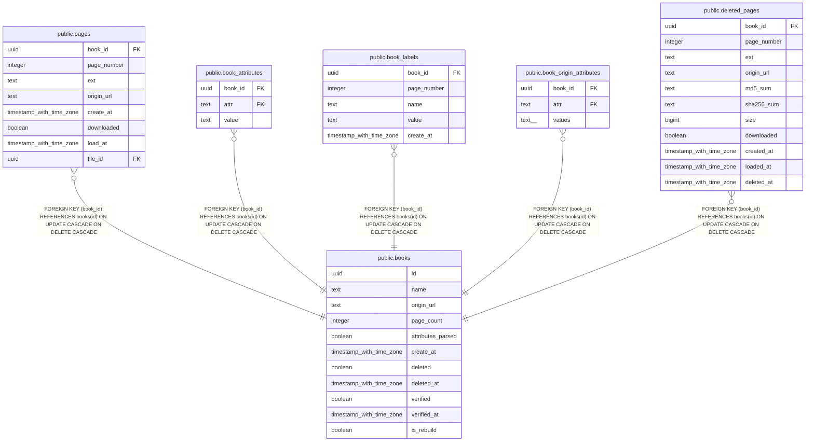

# public.books

## Description

## Columns

| Name | Type | Default | Nullable | Children | Parents | Comment |
| ---- | ---- | ------- | -------- | -------- | ------- | ------- |
| id | uuid |  | false | [public.pages](public.pages.md) [public.book_attributes](public.book_attributes.md) [public.book_labels](public.book_labels.md) [public.book_origin_attributes](public.book_origin_attributes.md) [public.deleted_pages](public.deleted_pages.md) |  |  |
| name | text |  | true |  |  |  |
| origin_url | text |  | true |  |  |  |
| page_count | integer |  | true |  |  |  |
| attributes_parsed | boolean | false | false |  |  |  |
| create_at | timestamp with time zone |  | false |  |  |  |
| deleted | boolean | false | false |  |  |  |
| deleted_at | timestamp with time zone |  | true |  |  |  |
| verified | boolean | false | false |  |  |  |
| verified_at | timestamp with time zone |  | true |  |  |  |
| is_rebuild | boolean | false | false |  |  |  |

## Constraints

| Name | Type | Definition |
| ---- | ---- | ---------- |
| books_pkey | PRIMARY KEY | PRIMARY KEY (id) |

## Indexes

| Name | Definition |
| ---- | ---------- |
| books_pkey | CREATE UNIQUE INDEX books_pkey ON public.books USING btree (id) |
| unparsed_books | CREATE INDEX unparsed_books ON public.books USING btree (id) WHERE (((name IS NULL) OR (page_count IS NULL) OR (attributes_parsed = false)) AND (origin_url IS NOT NULL) AND (deleted = false)) |
| unverified_books | CREATE INDEX unverified_books ON public.books USING btree (id) WHERE (verified = false) |
| book_origin_url | CREATE INDEX book_origin_url ON public.books USING hash (origin_url) WHERE (origin_url IS NOT NULL) |
| book_is_rebuild | CREATE INDEX book_is_rebuild ON public.books USING btree (id) WHERE (is_rebuild = true) |
| book_is_deleted | CREATE INDEX book_is_deleted ON public.books USING btree (id) WHERE (deleted = true) |

## Relations

---

> Generated by [tbls](https://github.com/k1LoW/tbls)
