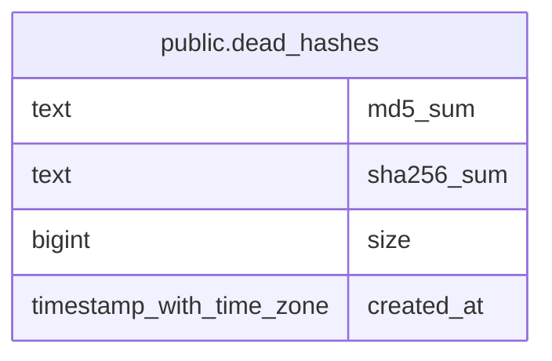

# public.dead_hashes

## Description

## Columns

| Name | Type | Default | Nullable | Children | Parents | Comment |
| ---- | ---- | ------- | -------- | -------- | ------- | ------- |
| md5_sum | text |  | false |  |  |  |
| sha256_sum | text |  | false |  |  |  |
| size | bigint |  | false |  |  |  |
| created_at | timestamp with time zone | now() | false |  |  |  |

## Constraints

| Name | Type | Definition |
| ---- | ---- | ---------- |
| dead_hashes_pkey | PRIMARY KEY | PRIMARY KEY (md5_sum, sha256_sum, size) |

## Indexes

| Name | Definition |
| ---- | ---------- |
| dead_hashes_pkey | CREATE UNIQUE INDEX dead_hashes_pkey ON public.dead_hashes USING btree (md5_sum, sha256_sum, size) |
| dead_hash_md5_sum | CREATE INDEX dead_hash_md5_sum ON public.dead_hashes USING hash (md5_sum) |

## Relations

---

> Generated by [tbls](https://github.com/k1LoW/tbls)
