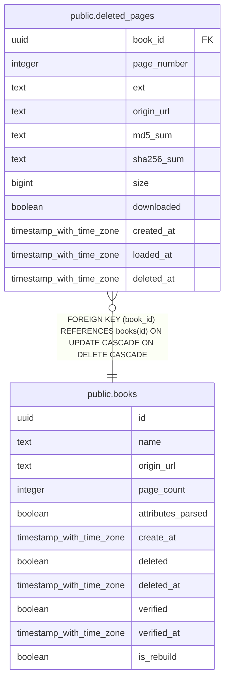

# public.deleted_pages

## Description

## Columns

| Name | Type | Default | Nullable | Children | Parents | Comment |
| ---- | ---- | ------- | -------- | -------- | ------- | ------- |
| book_id | uuid |  | false |  | [public.books](public.books.md) |  |
| page_number | integer |  | false |  |  |  |
| ext | text |  | false |  |  |  |
| origin_url | text |  | true |  |  |  |
| md5_sum | text |  | true |  |  |  |
| sha256_sum | text |  | true |  |  |  |
| size | bigint |  | true |  |  |  |
| downloaded | boolean | false | false |  |  |  |
| created_at | timestamp with time zone |  | false |  |  |  |
| loaded_at | timestamp with time zone |  | true |  |  |  |
| deleted_at | timestamp with time zone | now() | false |  |  |  |

## Constraints

| Name | Type | Definition |
| ---- | ---- | ---------- |
| deleted_pages_book_id_fkey | FOREIGN KEY | FOREIGN KEY (book_id) REFERENCES books(id) ON UPDATE CASCADE ON DELETE CASCADE |
| deleted_pages_pkey | PRIMARY KEY | PRIMARY KEY (book_id, page_number) |

## Indexes

| Name | Definition |
| ---- | ---------- |
| deleted_pages_pkey | CREATE UNIQUE INDEX deleted_pages_pkey ON public.deleted_pages USING btree (book_id, page_number) |

## Relations

---

> Generated by [tbls](https://github.com/k1LoW/tbls)
