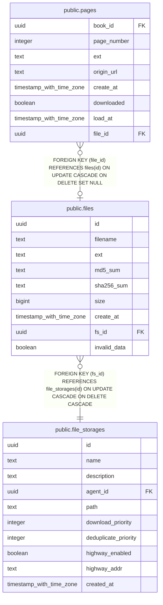

# public.files

## Description

## Columns

| Name | Type | Default | Nullable | Children | Parents | Comment |
| ---- | ---- | ------- | -------- | -------- | ------- | ------- |
| id | uuid |  | false | [public.pages](public.pages.md) |  |  |
| filename | text |  | false |  |  |  |
| ext | text |  | false |  |  |  |
| md5_sum | text |  | true |  |  |  |
| sha256_sum | text |  | true |  |  |  |
| size | bigint |  | true |  |  |  |
| create_at | timestamp with time zone |  | false |  |  |  |
| fs_id | uuid |  | false |  | [public.file_storages](public.file_storages.md) |  |
| invalid_data | boolean | false | false |  |  |  |

## Constraints

| Name | Type | Definition |
| ---- | ---- | ---------- |
| files_pkey | PRIMARY KEY | PRIMARY KEY (id) |
| files_fs_id_fkey | FOREIGN KEY | FOREIGN KEY (fs_id) REFERENCES file_storages(id) ON UPDATE CASCADE ON DELETE CASCADE |

## Indexes

| Name | Definition |
| ---- | ---------- |
| files_pkey | CREATE UNIQUE INDEX files_pkey ON public.files USING btree (id) |
| file_unhandled | CREATE INDEX file_unhandled ON public.files USING btree (id) WHERE ((md5_sum IS NULL) OR (sha256_sum IS NULL) OR (size IS NULL)) |
| file_md5_sum | CREATE INDEX file_md5_sum ON public.files USING hash (md5_sum) |
| file_invalid_data | CREATE INDEX file_invalid_data ON public.files USING btree (id, fs_id) WHERE (invalid_data = true) |

## Relations

---

> Generated by [tbls](https://github.com/k1LoW/tbls)
