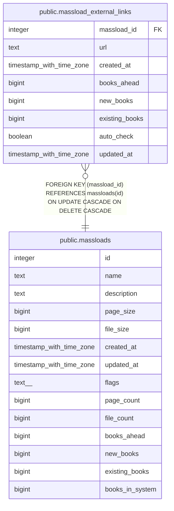

# public.massload_external_links

## Description

## Columns

| Name | Type | Default | Nullable | Children | Parents | Comment |
| ---- | ---- | ------- | -------- | -------- | ------- | ------- |
| massload_id | integer |  | false |  | [public.massloads](public.massloads.md) |  |
| url | text |  | false |  |  |  |
| created_at | timestamp with time zone |  | false |  |  |  |
| books_ahead | bigint |  | true |  |  |  |
| new_books | bigint |  | true |  |  |  |
| existing_books | bigint |  | true |  |  |  |
| auto_check | boolean | false | false |  |  |  |
| updated_at | timestamp with time zone |  | true |  |  |  |

## Constraints

| Name | Type | Definition |
| ---- | ---- | ---------- |
| massload_external_links_massload_id_fkey | FOREIGN KEY | FOREIGN KEY (massload_id) REFERENCES massloads(id) ON UPDATE CASCADE ON DELETE CASCADE |
| massload_external_links_url_unique | UNIQUE | UNIQUE (url, massload_id) |

## Indexes

| Name | Definition |
| ---- | ---------- |
| massload_external_links_url_unique | CREATE UNIQUE INDEX massload_external_links_url_unique ON public.massload_external_links USING btree (url, massload_id) |

## Relations

---

> Generated by [tbls](https://github.com/k1LoW/tbls)
