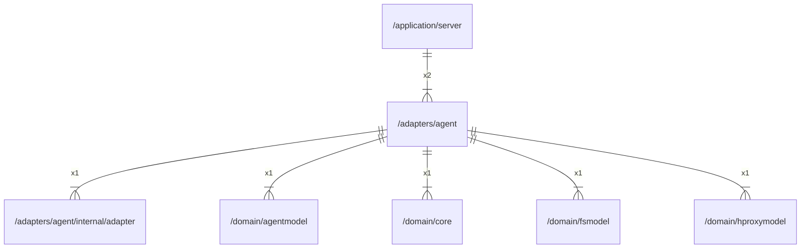

# agent

## Imports

|    Name     |                             Path                              | Inner | Count |
|:-----------:|:-------------------------------------------------------------:|:-----:|:-----:|
|    uuid     |                    github.com/google/uuid                     |  ❌   |   3   |
|   context   |                            context                            |  ❌   |   2   |
|     io      |                              io                               |  ❌   |   2   |
|    time     |                             time                              |  ❌   |   2   |
|     fmt     |                              fmt                              |  ❌   |   1   |
|   adapter   | [/adapters/agent/internal/adapter](agent/internal/adapter.md) |  ✅   |   1   |
| agentmodel  |         [/domain/agentmodel](../domain/agentmodel.md)         |  ✅   |   1   |
|    core     |               [/domain/core](../domain/core.md)               |  ✅   |   1   |
|   fsmodel   |            [/domain/fsmodel](../domain/fsmodel.md)            |  ✅   |   1   |
| hproxymodel |        [/domain/hproxymodel](../domain/hproxymodel.md)        |  ✅   |   1   |
|     url     |                            net/url                            |  ❌   |   1   |
|    sync     |                             sync                              |  ❌   |   1   |

## Used by

|  Name  |                      Path                       |
|:------:|:-----------------------------------------------:|
| server | [/application/server](../application/server.md) |

## Scheme

---

> Generated by [goArchLint](https://github.com/gbh007/goarchlint)
