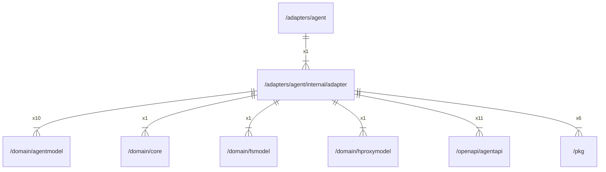

# adapter

## Imports

|    Name     |                         Path                          | Inner | Count |
|:-----------:|:-----------------------------------------------------:|:-----:|:-----:|
|     fmt     |                          fmt                          |  ❌   |  11   |
|  agentapi   |   [/openapi/agentapi](../../../openapi/agentapi.md)   |  ✅   |  11   |
|   context   |                        context                        |  ❌   |  10   |
| agentmodel  |  [/domain/agentmodel](../../../domain/agentmodel.md)  |  ✅   |  10   |
|     pkg     |                [/pkg](../../../pkg.md)                |  ✅   |   6   |
|     url     |                        net/url                        |  ❌   |   5   |
|    http     |                       net/http                        |  ❌   |   3   |
|     io      |                          io                           |  ❌   |   2   |
|    time     |                         time                          |  ❌   |   2   |
|   errors    |                        errors                         |  ❌   |   1   |
|    core     |        [/domain/core](../../../domain/core.md)        |  ✅   |   1   |
|   fsmodel   |     [/domain/fsmodel](../../../domain/fsmodel.md)     |  ✅   |   1   |
| hproxymodel | [/domain/hproxymodel](../../../domain/hproxymodel.md) |  ✅   |   1   |
|    uuid     |                github.com/google/uuid                 |  ❌   |   1   |
|    otel     |               go.opentelemetry.io/otel                |  ❌   |   1   |
| propagation |         go.opentelemetry.io/otel/propagation          |  ❌   |   1   |
|   syscall   |                        syscall                        |  ❌   |   1   |

## Used by

| Name  |               Path                |
|:-----:|:---------------------------------:|
| agent | [/adapters/agent](../../agent.md) |

## Scheme

---

> Generated by [goArchLint](https://github.com/gbh007/goarchlint)
