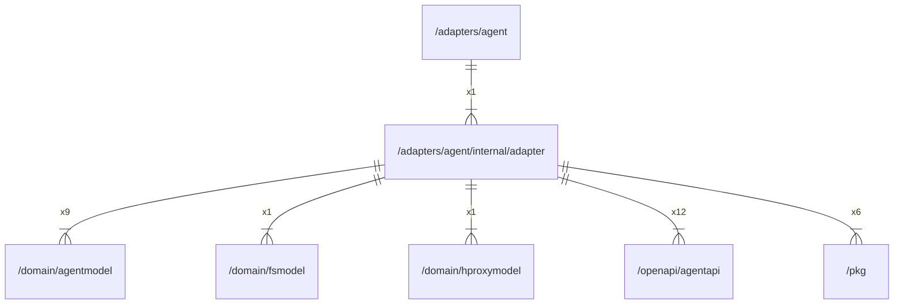

# adapter

## Imports

### Inner imports

| Name        | Path                                                  | Count |
|:------------|:------------------------------------------------------|------:|
| agentapi    | [/openapi/agentapi](../../../openapi/agentapi.md)     |    12 |
| agentmodel  | [/domain/agentmodel](../../../domain/agentmodel.md)   |     9 |
| pkg         | [/pkg](../../../pkg.md)                               |     6 |
| fsmodel     | [/domain/fsmodel](../../../domain/fsmodel.md)         |     1 |
| hproxymodel | [/domain/hproxymodel](../../../domain/hproxymodel.md) |     1 |

### External imports

| Name        | Path                                 | Count |
|:------------|:-------------------------------------|------:|
| uuid        | github.com/google/uuid               |     1 |
| otel        | go.opentelemetry.io/otel             |     1 |
| propagation | go.opentelemetry.io/otel/propagation |     1 |

### Std imports

| Name    | Path     | Count |
|:--------|:---------|------:|
| context | context  |    10 |
| url     | net/url  |     5 |
| http    | net/http |     4 |
| fmt     | fmt      |     3 |
| errors  | errors   |     2 |
| io      | io       |     2 |
| time    | time     |     2 |
| syscall | syscall  |     1 |

## Used by

| Name  | Path                              |
|:------|:----------------------------------|
| agent | [/adapters/agent](../../agent.md) |

## Scheme

```mermaid
erDiagram
    "/adapters/agent" ||--|{ "/adapters/agent/internal/adapter" : x1
    "/adapters/agent/internal/adapter" ||--|{ "/domain/agentmodel" : x9
    "/adapters/agent/internal/adapter" ||--|{ "/domain/fsmodel" : x1
    "/adapters/agent/internal/adapter" ||--|{ "/domain/hproxymodel" : x1
    "/adapters/agent/internal/adapter" ||--|{ "/openapi/agentapi" : x12
    "/adapters/agent/internal/adapter" ||--|{ "/pkg" : x6
```

---

> Generated by [goArchLint](https://github.com/gbh007/goarchlint)
