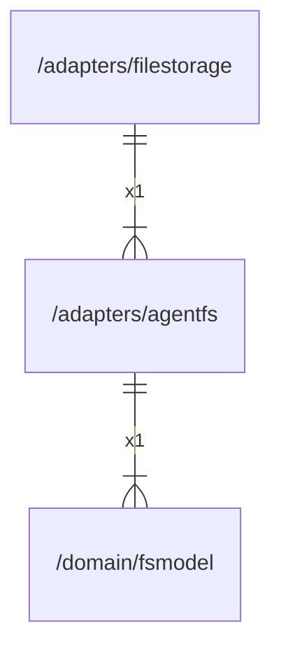

# agentfs

## Imports

|  Name   |                  Path                   | Inner | Count |
|:-------:|:---------------------------------------:|:-----:|:-----:|
| context |                 context                 |  ❌   |   1   |
|   fmt   |                   fmt                   |  ❌   |   1   |
| fsmodel | [/domain/fsmodel](../domain/fsmodel.md) |  ✅   |   1   |
|  uuid   |         github.com/google/uuid          |  ❌   |   1   |
|   io    |                   io                    |  ❌   |   1   |
|  slog   |                log/slog                 |  ❌   |   1   |

## Used by

|    Name     |                  Path                   |
|:-----------:|:---------------------------------------:|
| filestorage | [/adapters/filestorage](filestorage.md) |

## Scheme

---

> Generated by [goArchLint](https://github.com/gbh007/goarchlint)
