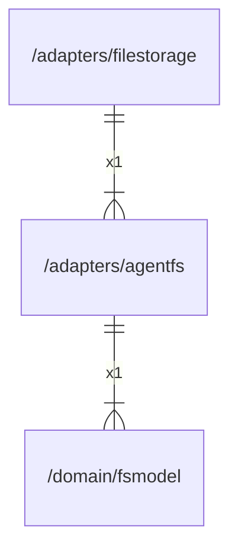

# agentfs

## Imports

### Inner imports

| Name    | Path                                    | Count |
|:--------|:----------------------------------------|------:|
| fsmodel | [/domain/fsmodel](../domain/fsmodel.md) |     1 |

### External imports

| Name | Path                   | Count |
|:-----|:-----------------------|------:|
| uuid | github.com/google/uuid |     1 |

### Std imports

| Name    | Path     | Count |
|:--------|:---------|------:|
| context | context  |     1 |
| fmt     | fmt      |     1 |
| io      | io       |     1 |
| slog    | log/slog |     1 |

## Used by

| Name        | Path                                    |
|:------------|:----------------------------------------|
| filestorage | [/adapters/filestorage](filestorage.md) |

## Scheme

```mermaid
erDiagram
    "/adapters/agentfs" ||--|{ "/domain/fsmodel" : x1
    "/adapters/filestorage" ||--|{ "/adapters/agentfs" : x1
```

---

> Generated by [goArchLint](https://github.com/gbh007/goarchlint)
