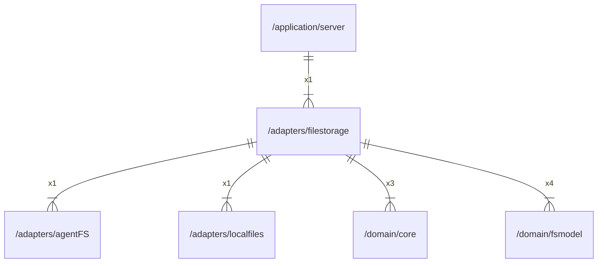

# filestorage

## Imports

|    Name    |                  Path                   | Inner | Count |
|:----------:|:---------------------------------------:|:-----:|:-----:|
|  context   |                 context                 |  ❌   |   5   |
|    fmt     |                   fmt                   |  ❌   |   5   |
|  fsmodel   | [/domain/fsmodel](../domain/fsmodel.md) |  ✅   |   4   |
|    uuid    |         github.com/google/uuid          |  ❌   |   4   |
|    time    |                  time                   |  ❌   |   4   |
|    core    |    [/domain/core](../domain/core.md)    |  ✅   |   3   |
|   errors   |                 errors                  |  ❌   |   2   |
|     io     |                   io                    |  ❌   |   2   |
|  agentFS   |     [/adapters/agentFS](agentFS.md)     |  ✅   |   1   |
| localfiles |  [/adapters/localfiles](localfiles.md)  |  ✅   |   1   |
|    slog    |                log/slog                 |  ❌   |   1   |
|    url     |                 net/url                 |  ❌   |   1   |
|   slices   |                 slices                  |  ❌   |   1   |
|    sync    |                  sync                   |  ❌   |   1   |

## Used by

|  Name  |                      Path                       |
|:------:|:-----------------------------------------------:|
| server | [/application/server](../application/server.md) |

## Scheme

---

> Generated by [goArchLint](https://github.com/gbh007/goarchlint)
