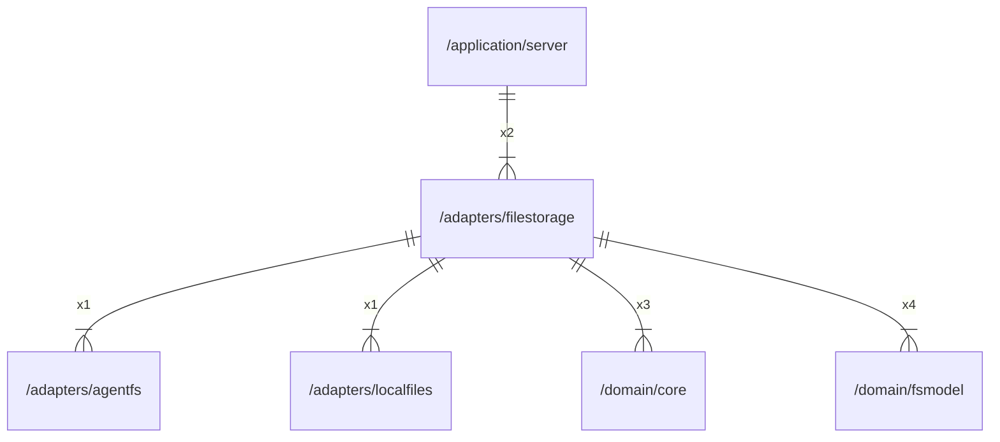

# filestorage

## Imports

### Inner imports

| Name       | Path                                    | Count |
|:-----------|:----------------------------------------|------:|
| fsmodel    | [/domain/fsmodel](../domain/fsmodel.md) |     4 |
| core       | [/domain/core](../domain/core.md)       |     3 |
| agentfs    | [/adapters/agentfs](agentfs.md)         |     1 |
| localfiles | [/adapters/localfiles](localfiles.md)   |     1 |

### External imports

| Name | Path                   | Count |
|:-----|:-----------------------|------:|
| uuid | github.com/google/uuid |     4 |

### Std imports

| Name    | Path     | Count |
|:--------|:---------|------:|
| context | context  |     5 |
| fmt     | fmt      |     5 |
| time    | time     |     4 |
| errors  | errors   |     2 |
| io      | io       |     2 |
| slog    | log/slog |     1 |
| url     | net/url  |     1 |
| slices  | slices   |     1 |
| sync    | sync     |     1 |

## Used by

| Name   | Path                                            |
|:-------|:------------------------------------------------|
| server | [/application/server](../application/server.md) |

## Scheme

```mermaid
erDiagram
    "/adapters/filestorage" ||--|{ "/adapters/agentfs" : x1
    "/adapters/filestorage" ||--|{ "/adapters/localfiles" : x1
    "/adapters/filestorage" ||--|{ "/domain/core" : x3
    "/adapters/filestorage" ||--|{ "/domain/fsmodel" : x4
    "/application/server" ||--|{ "/adapters/filestorage" : x2
```

---

> Generated by [goArchLint](https://github.com/gbh007/goarchlint)
