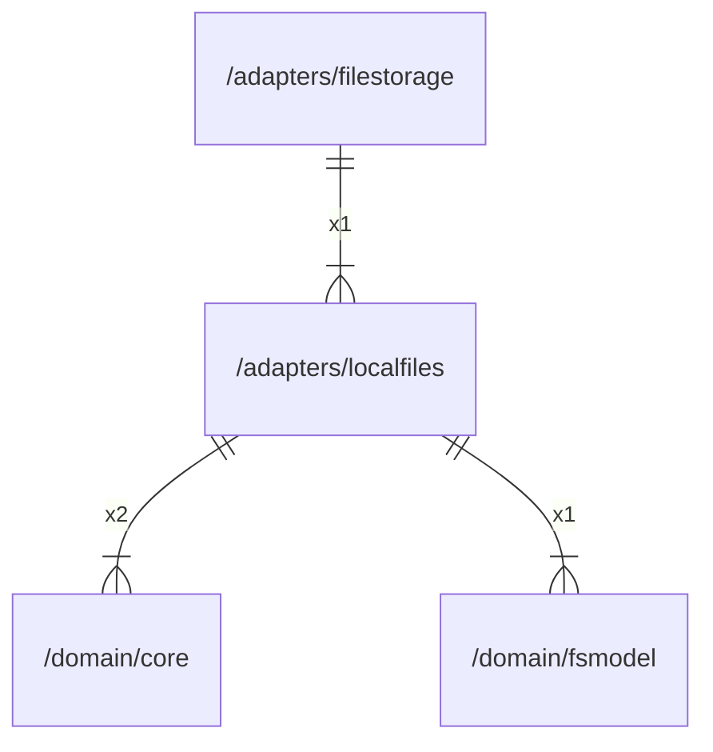

# localfiles

## Imports

|  Name   |                  Path                   | Inner | Count |
|:-------:|:---------------------------------------:|:-----:|:-----:|
|   fmt   |                   fmt                   |  ❌   |   5   |
|  uuid   |         github.com/google/uuid          |  ❌   |   5   |
|   os    |                   os                    |  ❌   |   5   |
| context |                 context                 |  ❌   |   4   |
|  slog   |                log/slog                 |  ❌   |   4   |
| errors  |                 errors                  |  ❌   |   3   |
|  core   |    [/domain/core](../domain/core.md)    |  ✅   |   2   |
|   io    |                   io                    |  ❌   |   2   |
|  path   |                  path                   |  ❌   |   2   |
|  bytes  |                  bytes                  |  ❌   |   1   |
| fsmodel | [/domain/fsmodel](../domain/fsmodel.md) |  ✅   |   1   |
|  unix   |          golang.org/x/sys/unix          |  ❌   |   1   |

## Used by

|    Name     |                  Path                   |
|:-----------:|:---------------------------------------:|
| filestorage | [/adapters/filestorage](filestorage.md) |

## Scheme

---

> Generated by [goArchLint](https://github.com/gbh007/goarchlint)
