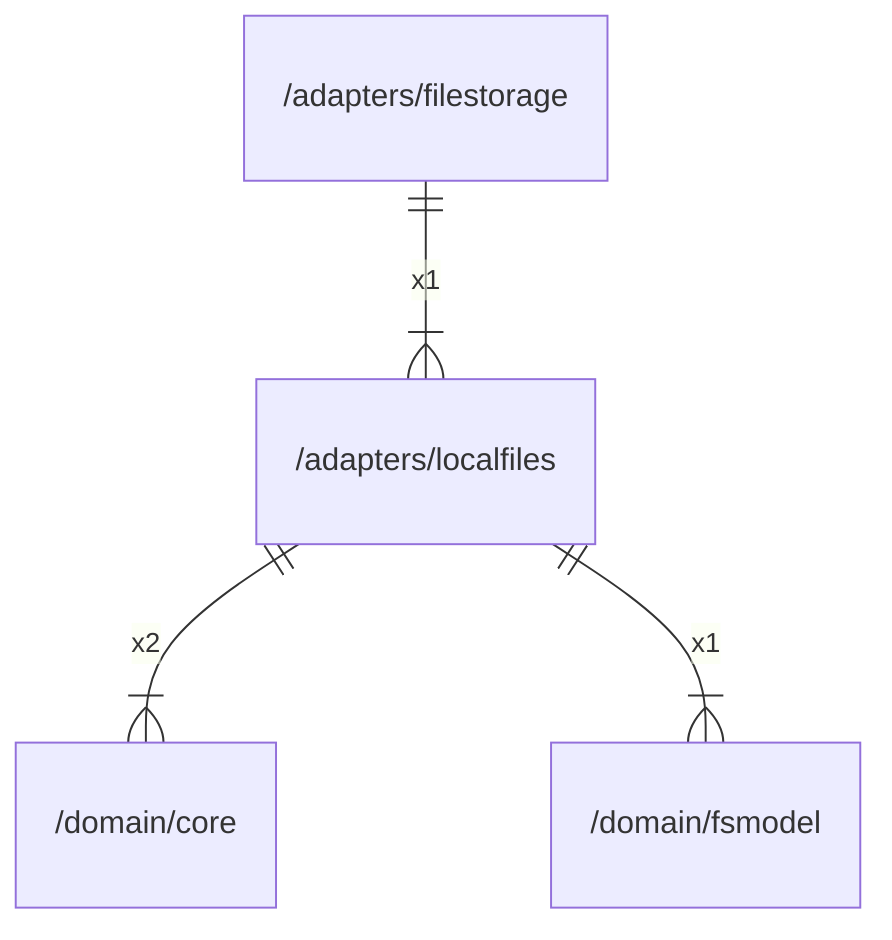

# localfiles

## Imports

### Inner imports

| Name    | Path                                    | Count |
|:--------|:----------------------------------------|------:|
| core    | [/domain/core](../domain/core.md)       |     2 |
| fsmodel | [/domain/fsmodel](../domain/fsmodel.md) |     1 |

### External imports

| Name | Path                   | Count |
|:-----|:-----------------------|------:|
| uuid | github.com/google/uuid |     5 |
| unix | golang.org/x/sys/unix  |     1 |

### Std imports

| Name    | Path     | Count |
|:--------|:---------|------:|
| fmt     | fmt      |     5 |
| os      | os       |     5 |
| context | context  |     4 |
| slog    | log/slog |     4 |
| errors  | errors   |     3 |
| io      | io       |     2 |
| path    | path     |     2 |
| bytes   | bytes    |     1 |

## Used by

| Name        | Path                                    |
|:------------|:----------------------------------------|
| filestorage | [/adapters/filestorage](filestorage.md) |

## Scheme

```mermaid
erDiagram
    "/adapters/filestorage" ||--|{ "/adapters/localfiles" : x1
    "/adapters/localfiles" ||--|{ "/domain/core" : x2
    "/adapters/localfiles" ||--|{ "/domain/fsmodel" : x1
```

---

> Generated by [goArchLint](https://github.com/gbh007/goarchlint)
