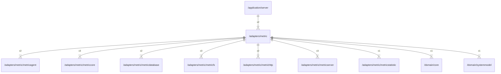

# metric

## Imports

|      Name       |                             Path                              | Inner | Count |
|:---------------:|:-------------------------------------------------------------:|:-----:|:-----:|
|      time       |                             time                              |  ❌   |   7   |
|   metriccore    |      [/adapters/metric/metriccore](metric/metriccore.md)      |  ✅   |   3   |
|    metricfs     |        [/adapters/metric/metricfs](metric/metricfs.md)        |  ✅   |   3   |
|  metricserver   |    [/adapters/metric/metricserver](metric/metricserver.md)    |  ✅   |   3   |
|       fmt       |                              fmt                              |  ❌   |   2   |
|   metricagent   |     [/adapters/metric/metricagent](metric/metricagent.md)     |  ✅   |   2   |
| metricdatabase  |  [/adapters/metric/metricdatabase](metric/metricdatabase.md)  |  ✅   |   2   |
|   metrichttp    |      [/adapters/metric/metrichttp](metric/metrichttp.md)      |  ✅   |   2   |
|      uuid       |                    github.com/google/uuid                     |  ❌   |   2   |
|     context     |                            context                            |  ❌   |   1   |
| metricstatistic | [/adapters/metric/metricstatistic](metric/metricstatistic.md) |  ✅   |   1   |
|      core       |               [/domain/core](../domain/core.md)               |  ✅   |   1   |
|   systemmodel   |        [/domain/systemmodel](../domain/systemmodel.md)        |  ✅   |   1   |
|   prometheus    |        github.com/prometheus/client_golang/prometheus         |  ❌   |   1   |
|   collectors    |   github.com/prometheus/client_golang/prometheus/collectors   |  ❌   |   1   |
|      slog       |                           log/slog                            |  ❌   |   1   |
|      sync       |                             sync                              |  ❌   |   1   |

## Used by

|  Name  |                      Path                       |
|:------:|:-----------------------------------------------:|
| server | [/application/server](../application/server.md) |

## Scheme

---

> Generated by [goArchLint](https://github.com/gbh007/goarchlint)
