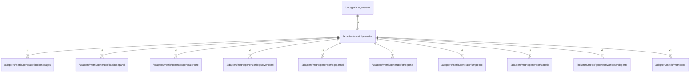

# generator

## Imports

|       Name       |                                     Path                                     | Inner | Count |
|:----------------:|:----------------------------------------------------------------------------:|:-----:|:-----:|
|    dashboard     |            github.com/grafana/grafana-foundation-sdk/go/dashboard            |  ❌   |   4   |
|       fmt        |                                     fmt                                      |  ❌   |   2   |
|  generatorcore   |    [/adapters/metric/generator/generatorcore](generator/generatorcore.md)    |  ✅   |   2   |
|    metriccore    |                 [/adapters/metric/metriccore](metriccore.md)                 |  ✅   |   2   |
|   bookandpages   |     [/adapters/metric/generator/bookandpages](generator/bookandpages.md)     |  ✅   |   1   |
|  databasepanel   |    [/adapters/metric/generator/databasepanel](generator/databasepanel.md)    |  ✅   |   1   |
| httpserverpanel  |  [/adapters/metric/generator/httpserverpanel](generator/httpserverpanel.md)  |  ✅   |   1   |
|    logspannel    |       [/adapters/metric/generator/logspannel](generator/logspannel.md)       |  ✅   |   1   |
|    otherpanel    |       [/adapters/metric/generator/otherpanel](generator/otherpanel.md)       |  ✅   |   1   |
|    simpleinfo    |       [/adapters/metric/generator/simpleinfo](generator/simpleinfo.md)       |  ✅   |   1   |
|    statistic     |        [/adapters/metric/generator/statistic](generator/statistic.md)        |  ✅   |   1   |
| workersandagents | [/adapters/metric/generator/workersandagents](generator/workersandagents.md) |  ✅   |   1   |
|     plugins      |           github.com/grafana/grafana-foundation-sdk/go/cog/plugins           |  ❌   |   1   |
|      promql      |                 github.com/grafana/promql-builder/go/promql                  |  ❌   |   1   |

## Used by

|       Name       |                          Path                          |
|:----------------:|:------------------------------------------------------:|
| grafanagenerator | [/cmd/grafanagenerator](../../cmd/grafanagenerator.md) |

## Scheme

---

> Generated by [goArchLint](https://github.com/gbh007/goarchlint)
