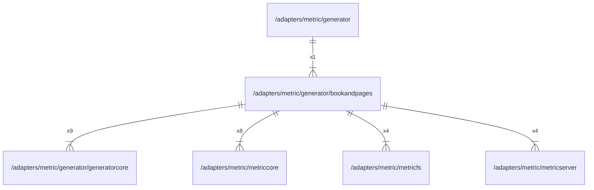

# bookandpages

## Imports

### Inner imports

| Name          | Path                                                         | Count |
|:--------------|:-------------------------------------------------------------|------:|
| generatorcore | [/adapters/metric/generator/generatorcore](generatorcore.md) |     9 |
| metriccore    | [/adapters/metric/metriccore](../metriccore.md)              |     8 |
| metricfs      | [/adapters/metric/metricfs](../metricfs.md)                  |     4 |
| metricserver  | [/adapters/metric/metricserver](../metricserver.md)          |     4 |

### External imports

| Name       | Path                                                    | Count |
|:-----------|:--------------------------------------------------------|------:|
| timeseries | github.com/grafana/grafana-foundation-sdk/go/timeseries |     8 |
| dashboard  | github.com/grafana/grafana-foundation-sdk/go/dashboard  |     1 |

### Std imports

| Name | Path | Count |
|:-----|:-----|------:|
| fmt  | fmt  |     8 |

## Used by

| Name      | Path                                          |
|:----------|:----------------------------------------------|
| generator | [/adapters/metric/generator](../generator.md) |

## Scheme

```mermaid
erDiagram
    "/adapters/metric/generator" ||--|{ "/adapters/metric/generator/bookandpages" : x1
    "/adapters/metric/generator/bookandpages" ||--|{ "/adapters/metric/generator/generatorcore" : x9
    "/adapters/metric/generator/bookandpages" ||--|{ "/adapters/metric/metriccore" : x8
    "/adapters/metric/generator/bookandpages" ||--|{ "/adapters/metric/metricfs" : x4
    "/adapters/metric/generator/bookandpages" ||--|{ "/adapters/metric/metricserver" : x4
```

---

> Generated by [goArchLint](https://github.com/gbh007/goarchlint)
