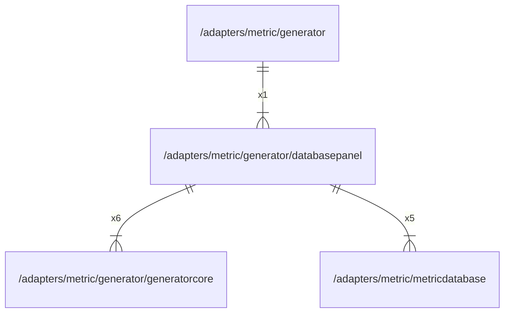

# databasepanel

## Imports

|      Name      |                             Path                             | Inner | Count |
|:--------------:|:------------------------------------------------------------:|:-----:|:-----:|
| generatorcore  | [/adapters/metric/generator/generatorcore](generatorcore.md) |  ✅   |   6   |
|      fmt       |                             fmt                              |  ❌   |   5   |
| metricdatabase |   [/adapters/metric/metricdatabase](../metricdatabase.md)    |  ✅   |   5   |
|   timeseries   |   github.com/grafana/grafana-foundation-sdk/go/timeseries    |  ❌   |   4   |
|   dashboard    |    github.com/grafana/grafana-foundation-sdk/go/dashboard    |  ❌   |   1   |
|     table      |      github.com/grafana/grafana-foundation-sdk/go/table      |  ❌   |   1   |
|     promql     |         github.com/grafana/promql-builder/go/promql          |  ❌   |   1   |

## Used by

|   Name    |                     Path                      |
|:---------:|:---------------------------------------------:|
| generator | [/adapters/metric/generator](../generator.md) |

## Scheme

---

> Generated by [goArchLint](https://github.com/gbh007/goarchlint)
