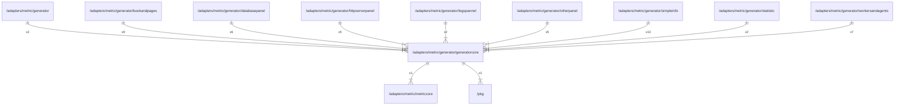

# generatorcore

## Imports

|    Name    |                           Path                            | Inner | Count |
|:----------:|:---------------------------------------------------------:|:-----:|:-----:|
| dashboard  |  github.com/grafana/grafana-foundation-sdk/go/dashboard   |  ❌   |   4   |
|   common   |    github.com/grafana/grafana-foundation-sdk/go/common    |  ❌   |   2   |
|   promql   |        github.com/grafana/promql-builder/go/promql        |  ❌   |   2   |
| metriccore |      [/adapters/metric/metriccore](../metriccore.md)      |  ✅   |   1   |
|    pkg     |                  [/pkg](../../../pkg.md)                  |  ✅   |   1   |
|    cog     |     github.com/grafana/grafana-foundation-sdk/go/cog      |  ❌   |   1   |
|  variants  | github.com/grafana/grafana-foundation-sdk/go/cog/variants |  ❌   |   1   |
| prometheus |  github.com/grafana/grafana-foundation-sdk/go/prometheus  |  ❌   |   1   |
|   table    |    github.com/grafana/grafana-foundation-sdk/go/table     |  ❌   |   1   |
| timeseries |  github.com/grafana/grafana-foundation-sdk/go/timeseries  |  ❌   |   1   |
|   units    |    github.com/grafana/grafana-foundation-sdk/go/units     |  ❌   |   1   |
|    cog     |         github.com/grafana/promql-builder/go/cog          |  ❌   |   1   |
|  strings   |                          strings                          |  ❌   |   1   |

## Used by

|       Name       |                                Path                                |
|:----------------:|:------------------------------------------------------------------:|
|    generator     |           [/adapters/metric/generator](../generator.md)            |
|   bookandpages   |     [/adapters/metric/generator/bookandpages](bookandpages.md)     |
|  databasepanel   |    [/adapters/metric/generator/databasepanel](databasepanel.md)    |
| httpserverpanel  |  [/adapters/metric/generator/httpserverpanel](httpserverpanel.md)  |
|    logspannel    |       [/adapters/metric/generator/logspannel](logspannel.md)       |
|    otherpanel    |       [/adapters/metric/generator/otherpanel](otherpanel.md)       |
|    simpleinfo    |       [/adapters/metric/generator/simpleinfo](simpleinfo.md)       |
|    statistic     |        [/adapters/metric/generator/statistic](statistic.md)        |
| workersandagents | [/adapters/metric/generator/workersandagents](workersandagents.md) |

## Scheme

---

> Generated by [goArchLint](https://github.com/gbh007/goarchlint)
