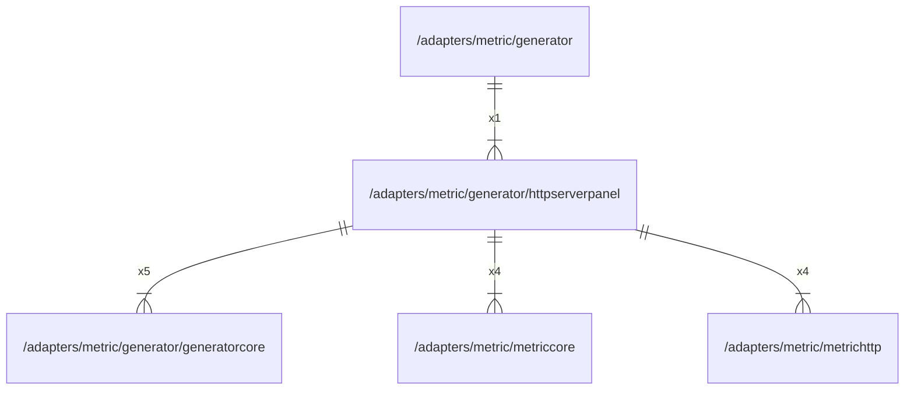

# httpserverpanel

## Imports

|     Name      |                             Path                             | Inner | Count |
|:-------------:|:------------------------------------------------------------:|:-----:|:-----:|
| generatorcore | [/adapters/metric/generator/generatorcore](generatorcore.md) |  ✅   |   5   |
|      fmt      |                             fmt                              |  ❌   |   4   |
|  metriccore   |       [/adapters/metric/metriccore](../metriccore.md)        |  ✅   |   4   |
|  metrichttp   |       [/adapters/metric/metrichttp](../metrichttp.md)        |  ✅   |   4   |
|  timeseries   |   github.com/grafana/grafana-foundation-sdk/go/timeseries    |  ❌   |   3   |
|   dashboard   |    github.com/grafana/grafana-foundation-sdk/go/dashboard    |  ❌   |   1   |
|     table     |      github.com/grafana/grafana-foundation-sdk/go/table      |  ❌   |   1   |
|    promql     |         github.com/grafana/promql-builder/go/promql          |  ❌   |   1   |

## Used by

|   Name    |                     Path                      |
|:---------:|:---------------------------------------------:|
| generator | [/adapters/metric/generator](../generator.md) |

## Scheme

---

> Generated by [goArchLint](https://github.com/gbh007/goarchlint)
