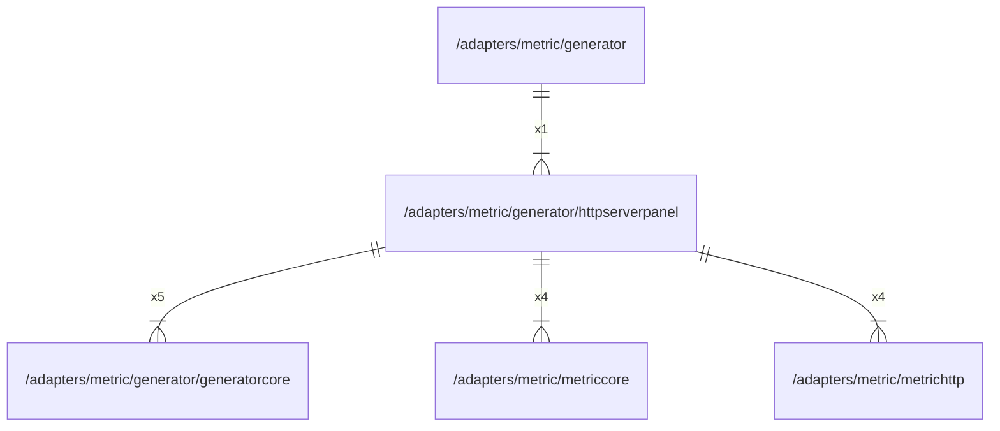

# httpserverpanel

## Imports

### Inner imports

| Name          | Path                                                         | Count |
|:--------------|:-------------------------------------------------------------|------:|
| generatorcore | [/adapters/metric/generator/generatorcore](generatorcore.md) |     5 |
| metriccore    | [/adapters/metric/metriccore](../metriccore.md)              |     4 |
| metrichttp    | [/adapters/metric/metrichttp](../metrichttp.md)              |     4 |

### External imports

| Name       | Path                                                    | Count |
|:-----------|:--------------------------------------------------------|------:|
| timeseries | github.com/grafana/grafana-foundation-sdk/go/timeseries |     3 |
| dashboard  | github.com/grafana/grafana-foundation-sdk/go/dashboard  |     1 |
| table      | github.com/grafana/grafana-foundation-sdk/go/table      |     1 |
| promql     | github.com/grafana/promql-builder/go/promql             |     1 |

### Std imports

| Name | Path | Count |
|:-----|:-----|------:|
| fmt  | fmt  |     4 |

## Used by

| Name      | Path                                          |
|:----------|:----------------------------------------------|
| generator | [/adapters/metric/generator](../generator.md) |

## Scheme

```mermaid
erDiagram
    "/adapters/metric/generator" ||--|{ "/adapters/metric/generator/httpserverpanel" : x1
    "/adapters/metric/generator/httpserverpanel" ||--|{ "/adapters/metric/generator/generatorcore" : x5
    "/adapters/metric/generator/httpserverpanel" ||--|{ "/adapters/metric/metriccore" : x4
    "/adapters/metric/generator/httpserverpanel" ||--|{ "/adapters/metric/metrichttp" : x4
```

---

> Generated by [goArchLint](https://github.com/gbh007/goarchlint)
