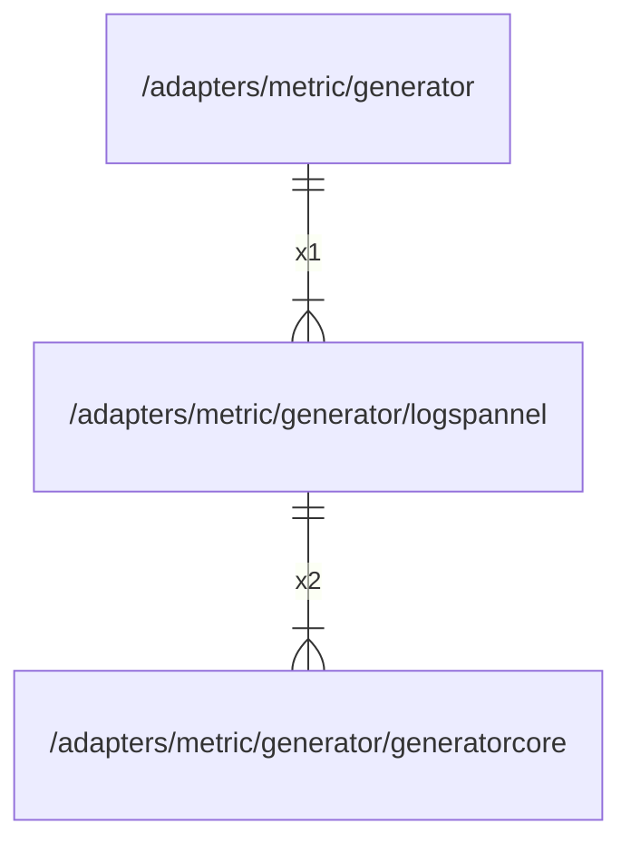

# logspannel

## Imports

|     Name      |                             Path                             | Inner | Count |
|:-------------:|:------------------------------------------------------------:|:-----:|:-----:|
| generatorcore | [/adapters/metric/generator/generatorcore](generatorcore.md) |  ✅   |   2   |
|      cog      |       github.com/grafana/grafana-foundation-sdk/go/cog       |  ❌   |   1   |
|   variants    |  github.com/grafana/grafana-foundation-sdk/go/cog/variants   |  ❌   |   1   |
|    common     |     github.com/grafana/grafana-foundation-sdk/go/common      |  ❌   |   1   |
|   dashboard   |    github.com/grafana/grafana-foundation-sdk/go/dashboard    |  ❌   |   1   |
|     logs      |      github.com/grafana/grafana-foundation-sdk/go/logs       |  ❌   |   1   |
|     loki      |      github.com/grafana/grafana-foundation-sdk/go/loki       |  ❌   |   1   |
|    promql     |         github.com/grafana/promql-builder/go/promql          |  ❌   |   1   |

## Used by

|   Name    |                     Path                      |
|:---------:|:---------------------------------------------:|
| generator | [/adapters/metric/generator](../generator.md) |

## Scheme

---

> Generated by [goArchLint](https://github.com/gbh007/goarchlint)
