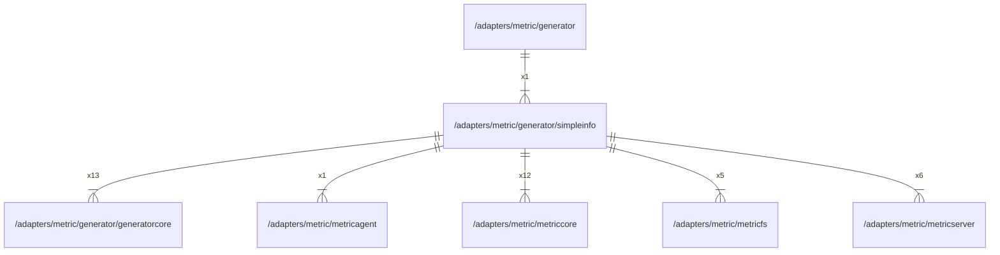

# simpleinfo

## Imports

|     Name      |                             Path                             | Inner | Count |
|:-------------:|:------------------------------------------------------------:|:-----:|:-----:|
| generatorcore | [/adapters/metric/generator/generatorcore](generatorcore.md) |  ✅   |  13   |
|  metriccore   |       [/adapters/metric/metriccore](../metriccore.md)        |  ✅   |  12   |
|      cog      |       github.com/grafana/grafana-foundation-sdk/go/cog       |  ❌   |  12   |
|   variants    |  github.com/grafana/grafana-foundation-sdk/go/cog/variants   |  ❌   |  12   |
|  prometheus   |   github.com/grafana/grafana-foundation-sdk/go/prometheus    |  ❌   |  12   |
|      fmt      |                             fmt                              |  ❌   |  11   |
|    promql     |         github.com/grafana/promql-builder/go/promql          |  ❌   |   9   |
| metricserver  |     [/adapters/metric/metricserver](../metricserver.md)      |  ✅   |   6   |
|   barchart    |    github.com/grafana/grafana-foundation-sdk/go/barchart     |  ❌   |   6   |
|   metricfs    |         [/adapters/metric/metricfs](../metricfs.md)          |  ✅   |   5   |
|     stat      |      github.com/grafana/grafana-foundation-sdk/go/stat       |  ❌   |   4   |
|    common     |     github.com/grafana/grafana-foundation-sdk/go/common      |  ❌   |   2   |
|   dashboard   |    github.com/grafana/grafana-foundation-sdk/go/dashboard    |  ❌   |   2   |
|   piechart    |    github.com/grafana/grafana-foundation-sdk/go/piechart     |  ❌   |   2   |
|  metricagent  |      [/adapters/metric/metricagent](../metricagent.md)       |  ✅   |   1   |

## Used by

|   Name    |                     Path                      |
|:---------:|:---------------------------------------------:|
| generator | [/adapters/metric/generator](../generator.md) |

## Scheme

---

> Generated by [goArchLint](https://github.com/gbh007/goarchlint)
