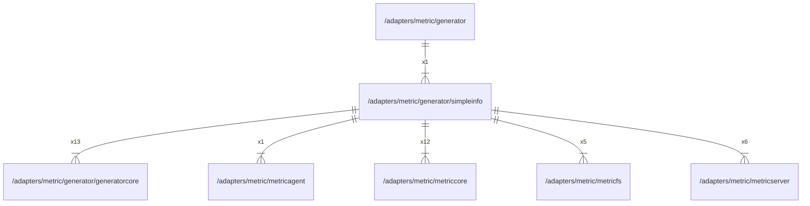

# simpleinfo

## Imports

### Inner imports

| Name          | Path                                                         | Count |
|:--------------|:-------------------------------------------------------------|------:|
| generatorcore | [/adapters/metric/generator/generatorcore](generatorcore.md) |    13 |
| metriccore    | [/adapters/metric/metriccore](../metriccore.md)              |    12 |
| metricserver  | [/adapters/metric/metricserver](../metricserver.md)          |     6 |
| metricfs      | [/adapters/metric/metricfs](../metricfs.md)                  |     5 |
| metricagent   | [/adapters/metric/metricagent](../metricagent.md)            |     1 |

### External imports

| Name       | Path                                                      | Count |
|:-----------|:----------------------------------------------------------|------:|
| cog        | github.com/grafana/grafana-foundation-sdk/go/cog          |    12 |
| variants   | github.com/grafana/grafana-foundation-sdk/go/cog/variants |    12 |
| prometheus | github.com/grafana/grafana-foundation-sdk/go/prometheus   |    12 |
| promql     | github.com/grafana/promql-builder/go/promql               |     9 |
| barchart   | github.com/grafana/grafana-foundation-sdk/go/barchart     |     6 |
| stat       | github.com/grafana/grafana-foundation-sdk/go/stat         |     4 |
| common     | github.com/grafana/grafana-foundation-sdk/go/common       |     2 |
| dashboard  | github.com/grafana/grafana-foundation-sdk/go/dashboard    |     2 |
| piechart   | github.com/grafana/grafana-foundation-sdk/go/piechart     |     2 |

### Std imports

| Name | Path | Count |
|:-----|:-----|------:|
| fmt  | fmt  |    10 |

## Used by

| Name      | Path                                          |
|:----------|:----------------------------------------------|
| generator | [/adapters/metric/generator](../generator.md) |

## Scheme

```mermaid
erDiagram
    "/adapters/metric/generator" ||--|{ "/adapters/metric/generator/simpleinfo" : x1
    "/adapters/metric/generator/simpleinfo" ||--|{ "/adapters/metric/generator/generatorcore" : x13
    "/adapters/metric/generator/simpleinfo" ||--|{ "/adapters/metric/metricagent" : x1
    "/adapters/metric/generator/simpleinfo" ||--|{ "/adapters/metric/metriccore" : x12
    "/adapters/metric/generator/simpleinfo" ||--|{ "/adapters/metric/metricfs" : x5
    "/adapters/metric/generator/simpleinfo" ||--|{ "/adapters/metric/metricserver" : x6
```

---

> Generated by [goArchLint](https://github.com/gbh007/goarchlint)
