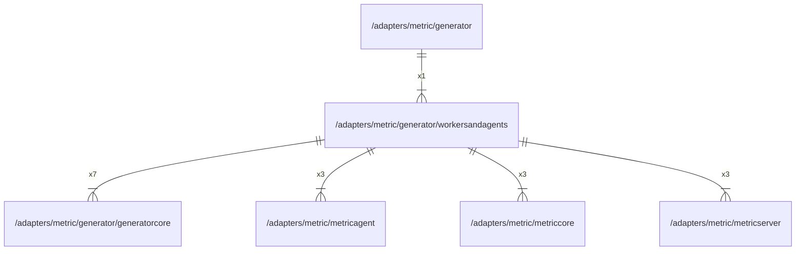

# workersandagents

## Imports

|     Name      |                             Path                             | Inner | Count |
|:-------------:|:------------------------------------------------------------:|:-----:|:-----:|
| generatorcore | [/adapters/metric/generator/generatorcore](generatorcore.md) |  ✅   |   7   |
|      fmt      |                             fmt                              |  ❌   |   6   |
|  timeseries   |   github.com/grafana/grafana-foundation-sdk/go/timeseries    |  ❌   |   6   |
|  metricagent  |      [/adapters/metric/metricagent](../metricagent.md)       |  ✅   |   3   |
|  metriccore   |       [/adapters/metric/metriccore](../metriccore.md)        |  ✅   |   3   |
| metricserver  |     [/adapters/metric/metricserver](../metricserver.md)      |  ✅   |   3   |
|   dashboard   |    github.com/grafana/grafana-foundation-sdk/go/dashboard    |  ❌   |   1   |

## Used by

|   Name    |                     Path                      |
|:---------:|:---------------------------------------------:|
| generator | [/adapters/metric/generator](../generator.md) |

## Scheme

---

> Generated by [goArchLint](https://github.com/gbh007/goarchlint)
