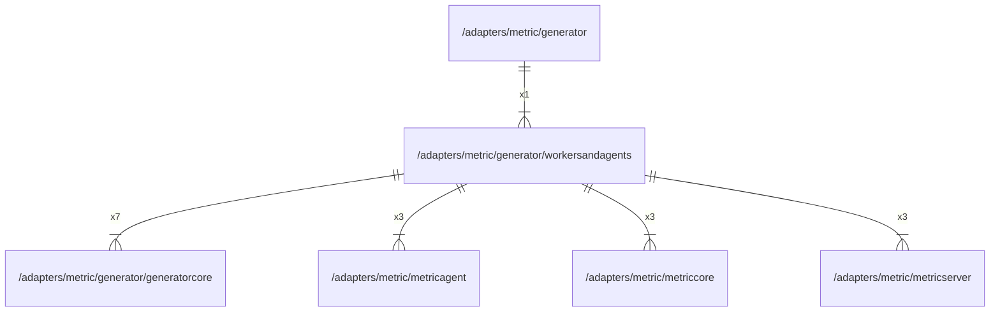

# workersandagents

## Imports

### Inner imports

| Name          | Path                                                         | Count |
|:--------------|:-------------------------------------------------------------|------:|
| generatorcore | [/adapters/metric/generator/generatorcore](generatorcore.md) |     7 |
| metricagent   | [/adapters/metric/metricagent](../metricagent.md)            |     3 |
| metriccore    | [/adapters/metric/metriccore](../metriccore.md)              |     3 |
| metricserver  | [/adapters/metric/metricserver](../metricserver.md)          |     3 |

### External imports

| Name       | Path                                                    | Count |
|:-----------|:--------------------------------------------------------|------:|
| timeseries | github.com/grafana/grafana-foundation-sdk/go/timeseries |     6 |
| dashboard  | github.com/grafana/grafana-foundation-sdk/go/dashboard  |     1 |

### Std imports

| Name | Path | Count |
|:-----|:-----|------:|
| fmt  | fmt  |     6 |

## Used by

| Name      | Path                                          |
|:----------|:----------------------------------------------|
| generator | [/adapters/metric/generator](../generator.md) |

## Scheme

```mermaid
erDiagram
    "/adapters/metric/generator" ||--|{ "/adapters/metric/generator/workersandagents" : x1
    "/adapters/metric/generator/workersandagents" ||--|{ "/adapters/metric/generator/generatorcore" : x7
    "/adapters/metric/generator/workersandagents" ||--|{ "/adapters/metric/metricagent" : x3
    "/adapters/metric/generator/workersandagents" ||--|{ "/adapters/metric/metriccore" : x3
    "/adapters/metric/generator/workersandagents" ||--|{ "/adapters/metric/metricserver" : x3
```

---

> Generated by [goArchLint](https://github.com/gbh007/goarchlint)
