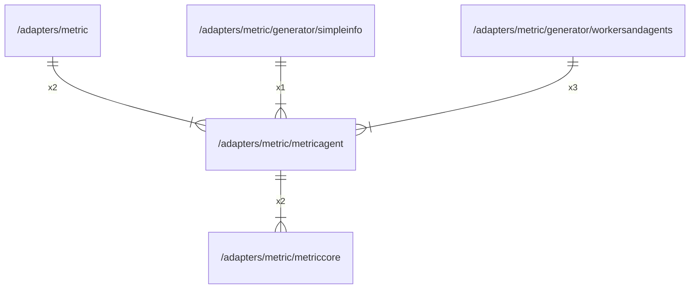

# metricagent

## Imports

|    Name    |                      Path                      | Inner | Count |
|:----------:|:----------------------------------------------:|:-----:|:-----:|
| metriccore |  [/adapters/metric/metriccore](metriccore.md)  |  ✅   |   2   |
| prometheus | github.com/prometheus/client_golang/prometheus |  ❌   |   2   |

## Used by

|       Name       |                                     Path                                     |
|:----------------:|:----------------------------------------------------------------------------:|
|      metric      |                       [/adapters/metric](../metric.md)                       |
|    simpleinfo    |       [/adapters/metric/generator/simpleinfo](generator/simpleinfo.md)       |
| workersandagents | [/adapters/metric/generator/workersandagents](generator/workersandagents.md) |

## Scheme

---

> Generated by [goArchLint](https://github.com/gbh007/goarchlint)
