# metriccore

## Imports

|    Name    |                      Path                      | Inner | Count |
|:----------:|:----------------------------------------------:|:-----:|:-----:|
| prometheus | github.com/prometheus/client_golang/prometheus |  ❌   |   2   |
|  version   |          [/version](../../version.md)          |  ✅   |   1   |

## Used by

|       Name       |                                     Path                                     |
|:----------------:|:----------------------------------------------------------------------------:|
|      metric      |                       [/adapters/metric](../metric.md)                       |
|    generator     |                  [/adapters/metric/generator](generator.md)                  |
|   bookandpages   |     [/adapters/metric/generator/bookandpages](generator/bookandpages.md)     |
|  generatorcore   |    [/adapters/metric/generator/generatorcore](generator/generatorcore.md)    |
| httpserverpanel  |  [/adapters/metric/generator/httpserverpanel](generator/httpserverpanel.md)  |
|    otherpanel    |       [/adapters/metric/generator/otherpanel](generator/otherpanel.md)       |
|    simpleinfo    |       [/adapters/metric/generator/simpleinfo](generator/simpleinfo.md)       |
| workersandagents | [/adapters/metric/generator/workersandagents](generator/workersandagents.md) |
|   metricagent    |                [/adapters/metric/metricagent](metricagent.md)                |
|  metricdatabase  |             [/adapters/metric/metricdatabase](metricdatabase.md)             |
|     metricfs     |                   [/adapters/metric/metricfs](metricfs.md)                   |
|    metrichttp    |                 [/adapters/metric/metrichttp](metrichttp.md)                 |
|   metricserver   |               [/adapters/metric/metricserver](metricserver.md)               |
| metricstatistic  |            [/adapters/metric/metricstatistic](metricstatistic.md)            |

## Scheme

```mermaid
erDiagram
    "/adapters/metric" ||--|{ "/adapters/metric/metriccore" : x3
    "/adapters/metric/generator" ||--|{ "/adapters/metric/metriccore" : x2
    "/adapters/metric/generator/bookandpages" ||--|{ "/adapters/metric/metriccore" : x8
    "/adapters/metric/generator/generatorcore" ||--|{ "/adapters/metric/metriccore" : x1
    "/adapters/metric/generator/httpserverpanel" ||--|{ "/adapters/metric/metriccore" : x4
    "/adapters/metric/generator/otherpanel" ||--|{ "/adapters/metric/metriccore" : x3
    "/adapters/metric/generator/simpleinfo" ||--|{ "/adapters/metric/metriccore" : x12
    "/adapters/metric/generator/workersandagents" ||--|{ "/adapters/metric/metriccore" : x3
    "/adapters/metric/metricagent" ||--|{ "/adapters/metric/metriccore" : x2
    "/adapters/metric/metriccore" ||--|{ "/version" : x1
    "/adapters/metric/metricdatabase" ||--|{ "/adapters/metric/metriccore" : x1
    "/adapters/metric/metricfs" ||--|{ "/adapters/metric/metriccore" : x2
    "/adapters/metric/metrichttp" ||--|{ "/adapters/metric/metriccore" : x1
    "/adapters/metric/metricserver" ||--|{ "/adapters/metric/metriccore" : x2
    "/adapters/metric/metricstatistic" ||--|{ "/adapters/metric/metriccore" : x2
```

---

> Generated by [goArchLint](https://github.com/gbh007/goarchlint)
