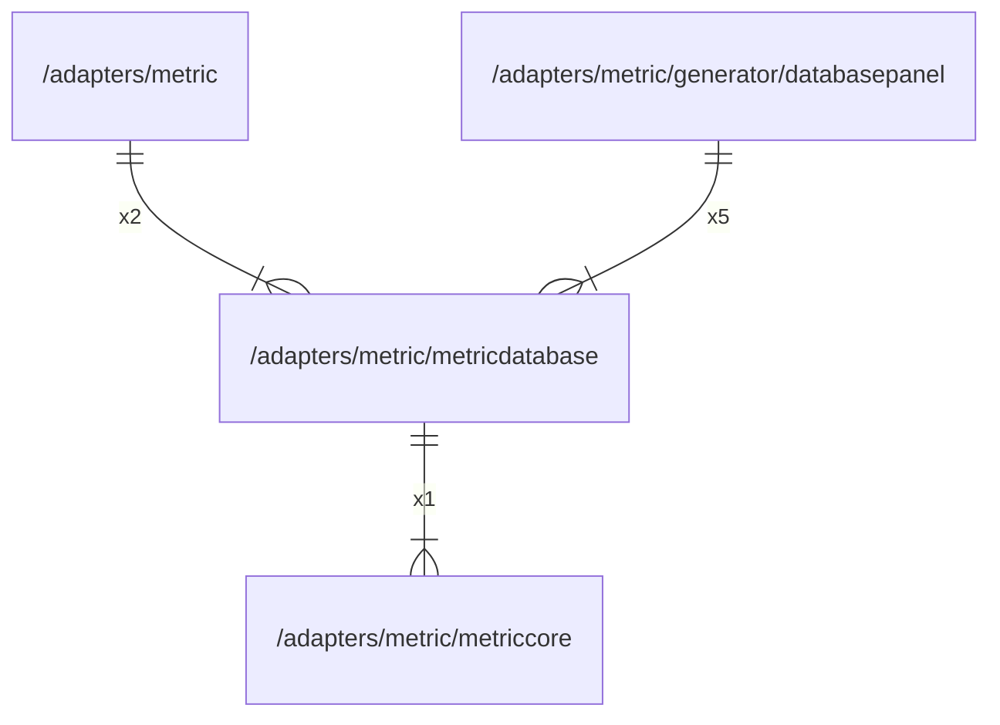

# metricdatabase

## Imports

|    Name    |                      Path                      | Inner | Count |
|:----------:|:----------------------------------------------:|:-----:|:-----:|
| prometheus | github.com/prometheus/client_golang/prometheus |  ❌   |   2   |
| metriccore |  [/adapters/metric/metriccore](metriccore.md)  |  ✅   |   1   |

## Used by

|     Name      |                                  Path                                  |
|:-------------:|:----------------------------------------------------------------------:|
|    metric     |                    [/adapters/metric](../metric.md)                    |
| databasepanel | [/adapters/metric/generator/databasepanel](generator/databasepanel.md) |

## Scheme

---

> Generated by [goArchLint](https://github.com/gbh007/goarchlint)
