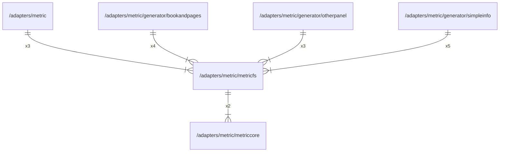

# metricfs

## Imports

|    Name    |                      Path                      | Inner | Count |
|:----------:|:----------------------------------------------:|:-----:|:-----:|
| metriccore |  [/adapters/metric/metriccore](metriccore.md)  |  ✅   |   2   |
| prometheus | github.com/prometheus/client_golang/prometheus |  ❌   |   2   |

## Used by

|     Name     |                                 Path                                 |
|:------------:|:--------------------------------------------------------------------:|
|    metric    |                   [/adapters/metric](../metric.md)                   |
| bookandpages | [/adapters/metric/generator/bookandpages](generator/bookandpages.md) |
|  otherpanel  |   [/adapters/metric/generator/otherpanel](generator/otherpanel.md)   |
|  simpleinfo  |   [/adapters/metric/generator/simpleinfo](generator/simpleinfo.md)   |

## Scheme

---

> Generated by [goArchLint](https://github.com/gbh007/goarchlint)
