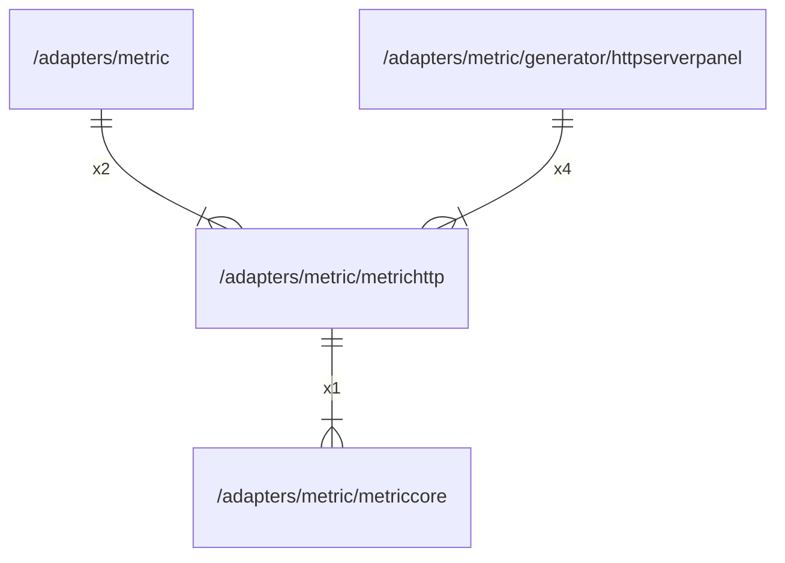

# metrichttp

## Imports

|    Name    |                      Path                      | Inner | Count |
|:----------:|:----------------------------------------------:|:-----:|:-----:|
| prometheus | github.com/prometheus/client_golang/prometheus |  ❌   |   2   |
| metriccore |  [/adapters/metric/metriccore](metriccore.md)  |  ✅   |   1   |

## Used by

|      Name       |                                    Path                                    |
|:---------------:|:--------------------------------------------------------------------------:|
|     metric      |                      [/adapters/metric](../metric.md)                      |
| httpserverpanel | [/adapters/metric/generator/httpserverpanel](generator/httpserverpanel.md) |

## Scheme

---

> Generated by [goArchLint](https://github.com/gbh007/goarchlint)
