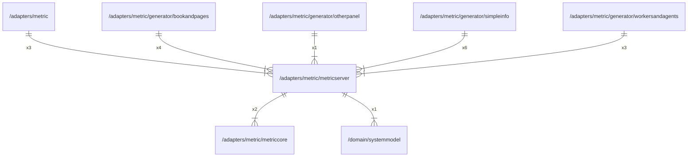

# metricserver

## Imports

|    Name     |                        Path                        | Inner | Count |
|:-----------:|:--------------------------------------------------:|:-----:|:-----:|
| prometheus  |   github.com/prometheus/client_golang/prometheus   |  ❌   |   3   |
| metriccore  |    [/adapters/metric/metriccore](metriccore.md)    |  ✅   |   2   |
|   context   |                      context                       |  ❌   |   1   |
| systemmodel | [/domain/systemmodel](../../domain/systemmodel.md) |  ✅   |   1   |
|    time     |                        time                        |  ❌   |   1   |

## Used by

|       Name       |                                     Path                                     |
|:----------------:|:----------------------------------------------------------------------------:|
|      metric      |                       [/adapters/metric](../metric.md)                       |
|   bookandpages   |     [/adapters/metric/generator/bookandpages](generator/bookandpages.md)     |
|    otherpanel    |       [/adapters/metric/generator/otherpanel](generator/otherpanel.md)       |
|    simpleinfo    |       [/adapters/metric/generator/simpleinfo](generator/simpleinfo.md)       |
| workersandagents | [/adapters/metric/generator/workersandagents](generator/workersandagents.md) |

## Scheme

---

> Generated by [goArchLint](https://github.com/gbh007/goarchlint)
