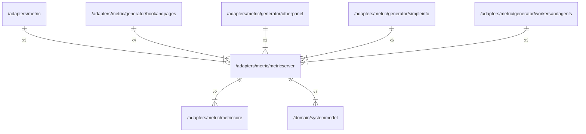

# metricserver

## Imports

### Inner imports

| Name        | Path                                               | Count |
|:------------|:---------------------------------------------------|------:|
| metriccore  | [/adapters/metric/metriccore](metriccore.md)       |     2 |
| systemmodel | [/domain/systemmodel](../../domain/systemmodel.md) |     1 |

### External imports

| Name       | Path                                           | Count |
|:-----------|:-----------------------------------------------|------:|
| prometheus | github.com/prometheus/client_golang/prometheus |     3 |

### Std imports

| Name    | Path    | Count |
|:--------|:--------|------:|
| context | context |     1 |

## Used by

| Name             | Path                                                                         |
|:-----------------|:-----------------------------------------------------------------------------|
| metric           | [/adapters/metric](../metric.md)                                             |
| bookandpages     | [/adapters/metric/generator/bookandpages](generator/bookandpages.md)         |
| otherpanel       | [/adapters/metric/generator/otherpanel](generator/otherpanel.md)             |
| simpleinfo       | [/adapters/metric/generator/simpleinfo](generator/simpleinfo.md)             |
| workersandagents | [/adapters/metric/generator/workersandagents](generator/workersandagents.md) |

## Scheme

```mermaid
erDiagram
    "/adapters/metric" ||--|{ "/adapters/metric/metricserver" : x3
    "/adapters/metric/generator/bookandpages" ||--|{ "/adapters/metric/metricserver" : x4
    "/adapters/metric/generator/otherpanel" ||--|{ "/adapters/metric/metricserver" : x1
    "/adapters/metric/generator/simpleinfo" ||--|{ "/adapters/metric/metricserver" : x6
    "/adapters/metric/generator/workersandagents" ||--|{ "/adapters/metric/metricserver" : x3
    "/adapters/metric/metricserver" ||--|{ "/adapters/metric/metriccore" : x2
    "/adapters/metric/metricserver" ||--|{ "/domain/systemmodel" : x1
```

---

> Generated by [goArchLint](https://github.com/gbh007/goarchlint)
