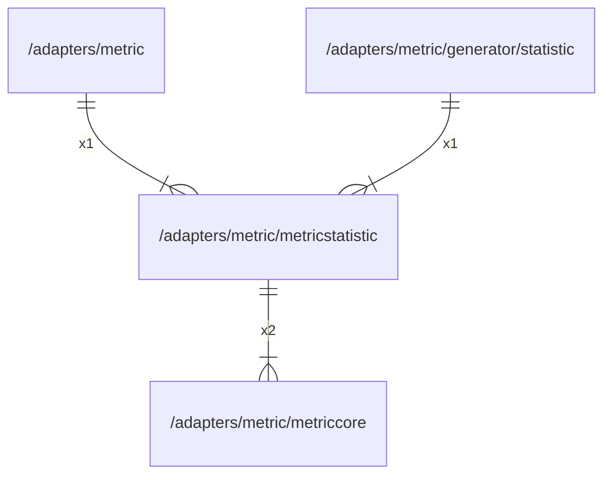

# metricstatistic

## Imports

|    Name    |                      Path                      | Inner | Count |
|:----------:|:----------------------------------------------:|:-----:|:-----:|
| metriccore |  [/adapters/metric/metriccore](metriccore.md)  |  ✅   |   2   |
| prometheus | github.com/prometheus/client_golang/prometheus |  ❌   |   2   |
|   atomic   |                  sync/atomic                   |  ❌   |   1   |

## Used by

|   Name    |                              Path                              |
|:---------:|:--------------------------------------------------------------:|
|  metric   |                [/adapters/metric](../metric.md)                |
| statistic | [/adapters/metric/generator/statistic](generator/statistic.md) |

## Scheme

---

> Generated by [goArchLint](https://github.com/gbh007/goarchlint)
