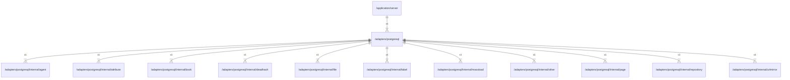

# postgresql

## Imports

|    Name    |                                     Path                                      | Inner | Count |
|:----------:|:-----------------------------------------------------------------------------:|:-----:|:-----:|
|  context   |                                    context                                    |  ❌   |   1   |
|    fmt     |                                      fmt                                      |  ❌   |   1   |
|   agent    |      [/adapters/postgresql/internal/agent](postgresql/internal/agent.md)      |  ✅   |   1   |
| attribute  |  [/adapters/postgresql/internal/attribute](postgresql/internal/attribute.md)  |  ✅   |   1   |
|    book    |       [/adapters/postgresql/internal/book](postgresql/internal/book.md)       |  ✅   |   1   |
|  deadhash  |   [/adapters/postgresql/internal/deadhash](postgresql/internal/deadhash.md)   |  ✅   |   1   |
|    file    |       [/adapters/postgresql/internal/file](postgresql/internal/file.md)       |  ✅   |   1   |
|   label    |      [/adapters/postgresql/internal/label](postgresql/internal/label.md)      |  ✅   |   1   |
|  massload  |   [/adapters/postgresql/internal/massload](postgresql/internal/massload.md)   |  ✅   |   1   |
|   other    |      [/adapters/postgresql/internal/other](postgresql/internal/other.md)      |  ✅   |   1   |
|    page    |       [/adapters/postgresql/internal/page](postgresql/internal/page.md)       |  ✅   |   1   |
| repository | [/adapters/postgresql/internal/repository](postgresql/internal/repository.md) |  ✅   |   1   |
| urlmirror  |  [/adapters/postgresql/internal/urlmirror](postgresql/internal/urlmirror.md)  |  ✅   |   1   |
|   trace    |                        go.opentelemetry.io/otel/trace                         |  ❌   |   1   |
|    slog    |                                   log/slog                                    |  ❌   |   1   |

## Used by

|  Name  |                      Path                       |
|:------:|:-----------------------------------------------:|
| server | [/application/server](../application/server.md) |

## Scheme

---

> Generated by [goArchLint](https://github.com/gbh007/goarchlint)
