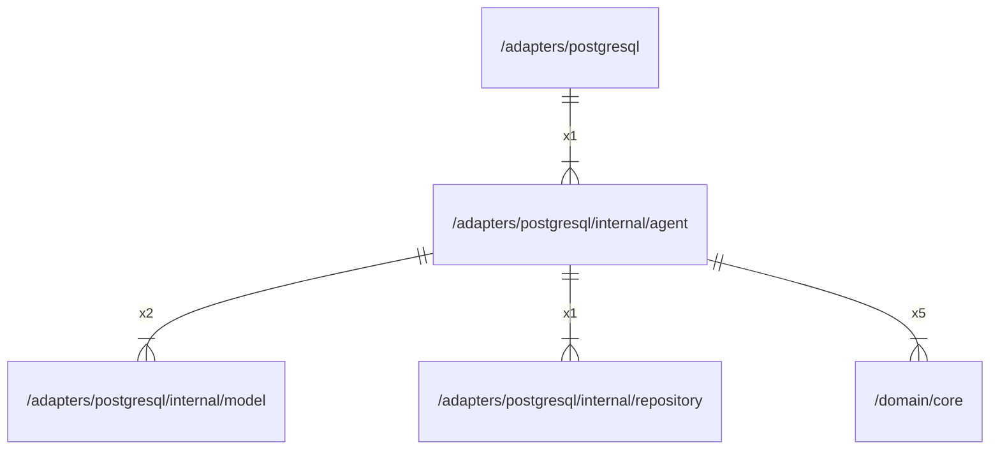

# agent

## Imports

|    Name    |                           Path                            | Inner | Count |
|:----------:|:---------------------------------------------------------:|:-----:|:-----:|
|  context   |                          context                          |  ❌   |   5   |
|    fmt     |                            fmt                            |  ❌   |   5   |
|  squirrel  |              github.com/Masterminds/squirrel              |  ❌   |   5   |
|    core    |          [/domain/core](../../../domain/core.md)          |  ✅   |   5   |
|   model    |      [/adapters/postgresql/internal/model](model.md)      |  ✅   |   2   |
|    uuid    |                  github.com/google/uuid                   |  ❌   |   2   |
|    sql     |                       database/sql                        |  ❌   |   1   |
|   errors   |                          errors                           |  ❌   |   1   |
| repository | [/adapters/postgresql/internal/repository](repository.md) |  ✅   |   1   |

## Used by

|    Name    |                    Path                     |
|:----------:|:-------------------------------------------:|
| postgresql | [/adapters/postgresql](../../postgresql.md) |

## Scheme

---

> Generated by [goArchLint](https://github.com/gbh007/goarchlint)
