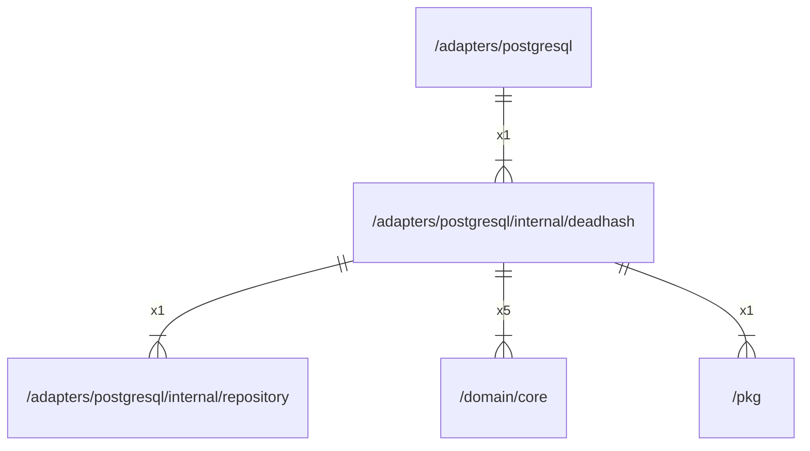

# deadhash

## Imports

|    Name    |                           Path                            | Inner | Count |
|:----------:|:---------------------------------------------------------:|:-----:|:-----:|
|  context   |                          context                          |  ❌   |   5   |
|    fmt     |                            fmt                            |  ❌   |   5   |
|  squirrel  |              github.com/Masterminds/squirrel              |  ❌   |   5   |
|    core    |          [/domain/core](../../../domain/core.md)          |  ✅   |   5   |
| repository | [/adapters/postgresql/internal/repository](repository.md) |  ✅   |   1   |
|    pkg     |                  [/pkg](../../../pkg.md)                  |  ✅   |   1   |
|     v5     |                  github.com/jackc/pgx/v5                  |  ❌   |   1   |
|    slog    |                         log/slog                          |  ❌   |   1   |

## Used by

|    Name    |                    Path                     |
|:----------:|:-------------------------------------------:|
| postgresql | [/adapters/postgresql](../../postgresql.md) |

## Scheme

---

> Generated by [goArchLint](https://github.com/gbh007/goarchlint)
