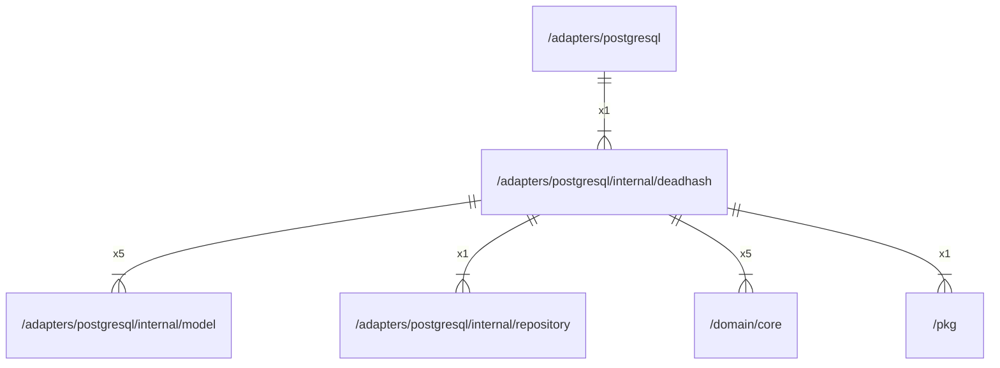

# deadhash

## Imports

### Inner imports

| Name       | Path                                                      | Count |
|:-----------|:----------------------------------------------------------|------:|
| model      | [/adapters/postgresql/internal/model](model.md)           |     5 |
| core       | [/domain/core](../../../domain/core.md)                   |     5 |
| repository | [/adapters/postgresql/internal/repository](repository.md) |     1 |
| pkg        | [/pkg](../../../pkg.md)                                   |     1 |

### External imports

| Name     | Path                            | Count |
|:---------|:--------------------------------|------:|
| squirrel | github.com/Masterminds/squirrel |     5 |
| v5       | github.com/jackc/pgx/v5         |     1 |

### Std imports

| Name    | Path     | Count |
|:--------|:---------|------:|
| context | context  |     5 |
| fmt     | fmt      |     5 |
| slog    | log/slog |     1 |

## Used by

| Name       | Path                                        |
|:-----------|:--------------------------------------------|
| postgresql | [/adapters/postgresql](../../postgresql.md) |

## Scheme

```mermaid
erDiagram
    "/adapters/postgresql" ||--|{ "/adapters/postgresql/internal/deadhash" : x1
    "/adapters/postgresql/internal/deadhash" ||--|{ "/adapters/postgresql/internal/model" : x5
    "/adapters/postgresql/internal/deadhash" ||--|{ "/adapters/postgresql/internal/repository" : x1
    "/adapters/postgresql/internal/deadhash" ||--|{ "/domain/core" : x5
    "/adapters/postgresql/internal/deadhash" ||--|{ "/pkg" : x1
```

---

> Generated by [goArchLint](https://github.com/gbh007/goarchlint)
