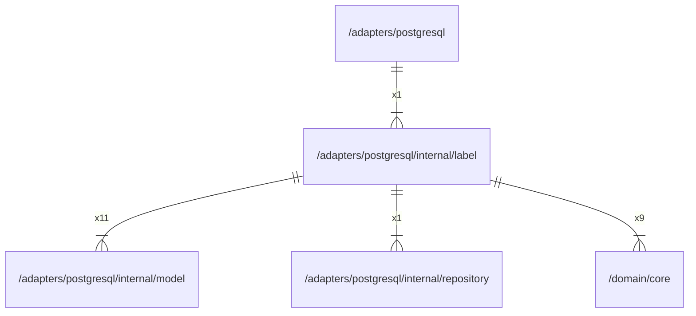

# label

## Imports

### Inner imports

| Name       | Path                                                      | Count |
|:-----------|:----------------------------------------------------------|------:|
| model      | [/adapters/postgresql/internal/model](model.md)           |    11 |
| core       | [/domain/core](../../../domain/core.md)                   |     9 |
| repository | [/adapters/postgresql/internal/repository](repository.md) |     1 |

### External imports

| Name     | Path                            | Count |
|:---------|:--------------------------------|------:|
| squirrel | github.com/Masterminds/squirrel |    11 |
| uuid     | github.com/google/uuid          |     3 |
| v5       | github.com/jackc/pgx/v5         |     2 |

### Std imports

| Name    | Path         | Count |
|:--------|:-------------|------:|
| context | context      |    11 |
| fmt     | fmt          |    11 |
| sql     | database/sql |     2 |
| errors  | errors       |     2 |
| slog    | log/slog     |     2 |

## Used by

| Name       | Path                                        |
|:-----------|:--------------------------------------------|
| postgresql | [/adapters/postgresql](../../postgresql.md) |

## Scheme

```mermaid
erDiagram
    "/adapters/postgresql" ||--|{ "/adapters/postgresql/internal/label" : x1
    "/adapters/postgresql/internal/label" ||--|{ "/adapters/postgresql/internal/model" : x11
    "/adapters/postgresql/internal/label" ||--|{ "/adapters/postgresql/internal/repository" : x1
    "/adapters/postgresql/internal/label" ||--|{ "/domain/core" : x9
```

---

> Generated by [goArchLint](https://github.com/gbh007/goarchlint)
