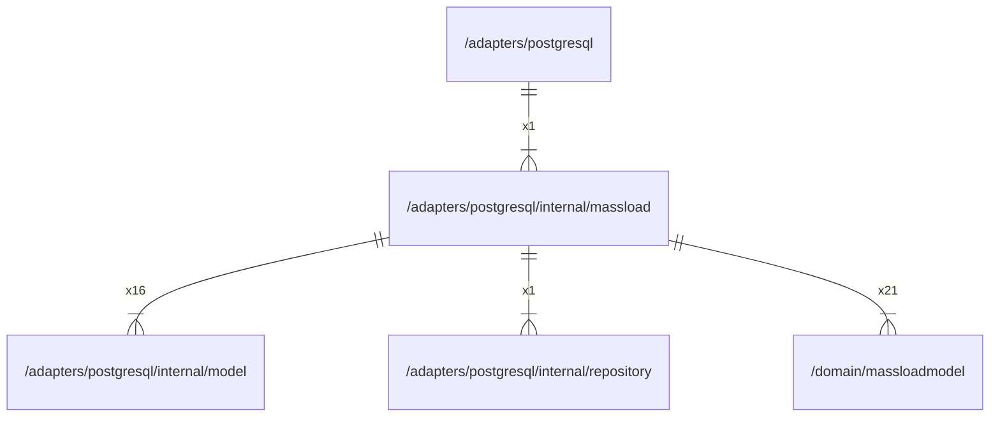

# massload

## Imports

|     Name      |                           Path                            | Inner | Count |
|:-------------:|:---------------------------------------------------------:|:-----:|:-----:|
|    context    |                          context                          |  ❌   |  24   |
|      fmt      |                            fmt                            |  ❌   |  24   |
|   squirrel    |              github.com/Masterminds/squirrel              |  ❌   |  24   |
| massloadmodel | [/domain/massloadmodel](../../../domain/massloadmodel.md) |  ✅   |  21   |
|     model     |      [/adapters/postgresql/internal/model](model.md)      |  ✅   |  16   |
|      url      |                          net/url                          |  ❌   |   2   |
|  repository   | [/adapters/postgresql/internal/repository](repository.md) |  ✅   |   1   |

## Used by

|    Name    |                    Path                     |
|:----------:|:-------------------------------------------:|
| postgresql | [/adapters/postgresql](../../postgresql.md) |

## Scheme

---

> Generated by [goArchLint](https://github.com/gbh007/goarchlint)
