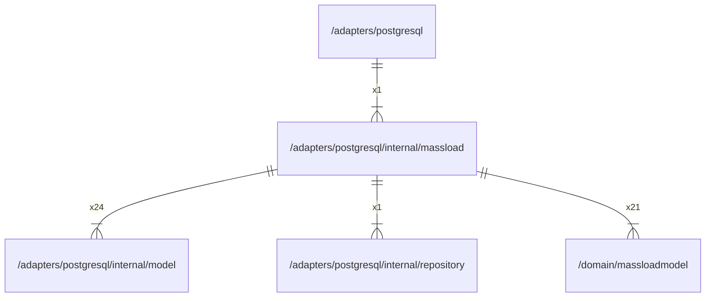

# massload

## Imports

### Inner imports

| Name          | Path                                                      | Count |
|:--------------|:----------------------------------------------------------|------:|
| model         | [/adapters/postgresql/internal/model](model.md)           |    24 |
| massloadmodel | [/domain/massloadmodel](../../../domain/massloadmodel.md) |    21 |
| repository    | [/adapters/postgresql/internal/repository](repository.md) |     1 |

### External imports

| Name     | Path                            | Count |
|:---------|:--------------------------------|------:|
| squirrel | github.com/Masterminds/squirrel |    24 |

### Std imports

| Name    | Path    | Count |
|:--------|:--------|------:|
| context | context |    24 |
| fmt     | fmt     |    24 |
| url     | net/url |     2 |

## Used by

| Name       | Path                                        |
|:-----------|:--------------------------------------------|
| postgresql | [/adapters/postgresql](../../postgresql.md) |

## Scheme

```mermaid
erDiagram
    "/adapters/postgresql" ||--|{ "/adapters/postgresql/internal/massload" : x1
    "/adapters/postgresql/internal/massload" ||--|{ "/adapters/postgresql/internal/model" : x24
    "/adapters/postgresql/internal/massload" ||--|{ "/adapters/postgresql/internal/repository" : x1
    "/adapters/postgresql/internal/massload" ||--|{ "/domain/massloadmodel" : x21
```

---

> Generated by [goArchLint](https://github.com/gbh007/goarchlint)
