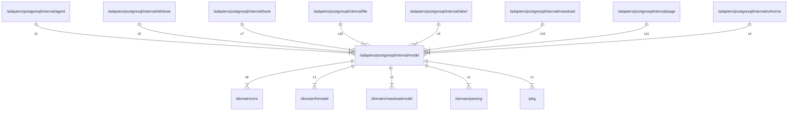

# model

## Imports

|     Name      |                           Path                            | Inner | Count |
|:-------------:|:---------------------------------------------------------:|:-----:|:-----:|
|      v5       |                  github.com/jackc/pgx/v5                  |  ❌   |  12   |
|      fmt      |                            fmt                            |  ❌   |  11   |
|      sql      |                       database/sql                        |  ❌   |  10   |
|     core      |          [/domain/core](../../../domain/core.md)          |  ✅   |   8   |
|      url      |                          net/url                          |  ❌   |   8   |
|     uuid      |                  github.com/google/uuid                   |  ❌   |   4   |
|    fsmodel    |       [/domain/fsmodel](../../../domain/fsmodel.md)       |  ✅   |   1   |
| massloadmodel | [/domain/massloadmodel](../../../domain/massloadmodel.md) |  ✅   |   1   |
|    parsing    |       [/domain/parsing](../../../domain/parsing.md)       |  ✅   |   1   |
|      pkg      |                  [/pkg](../../../pkg.md)                  |  ✅   |   1   |
|     time      |                           time                            |  ❌   |   1   |

## Used by

|   Name    |                          Path                           |
|:---------:|:-------------------------------------------------------:|
|   agent   |     [/adapters/postgresql/internal/agent](agent.md)     |
| attribute | [/adapters/postgresql/internal/attribute](attribute.md) |
|   book    |      [/adapters/postgresql/internal/book](book.md)      |
|   file    |      [/adapters/postgresql/internal/file](file.md)      |
|   label   |     [/adapters/postgresql/internal/label](label.md)     |
| massload  |  [/adapters/postgresql/internal/massload](massload.md)  |
|   page    |      [/adapters/postgresql/internal/page](page.md)      |
| urlmirror | [/adapters/postgresql/internal/urlmirror](urlmirror.md) |

## Scheme

---

> Generated by [goArchLint](https://github.com/gbh007/goarchlint)
