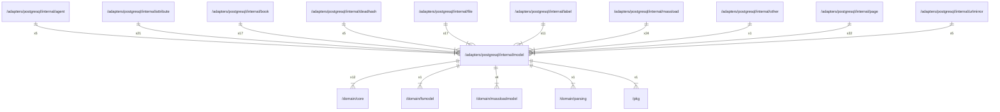

# model

## Imports

### Inner imports

| Name          | Path                                                      | Count |
|:--------------|:----------------------------------------------------------|------:|
| core          | [/domain/core](../../../domain/core.md)                   |    12 |
| massloadmodel | [/domain/massloadmodel](../../../domain/massloadmodel.md) |     4 |
| fsmodel       | [/domain/fsmodel](../../../domain/fsmodel.md)             |     1 |
| parsing       | [/domain/parsing](../../../domain/parsing.md)             |     1 |
| pkg           | [/pkg](../../../pkg.md)                                   |     1 |

### External imports

| Name | Path                    | Count |
|:-----|:------------------------|------:|
| v5   | github.com/jackc/pgx/v5 |    19 |
| uuid | github.com/google/uuid  |     4 |

### Std imports

| Name | Path         | Count |
|:-----|:-------------|------:|
| fmt  | fmt          |    18 |
| sql  | database/sql |    15 |
| url  | net/url      |     8 |
| time | time         |     1 |

## Used by

| Name      | Path                                                    |
|:----------|:--------------------------------------------------------|
| agent     | [/adapters/postgresql/internal/agent](agent.md)         |
| attribute | [/adapters/postgresql/internal/attribute](attribute.md) |
| book      | [/adapters/postgresql/internal/book](book.md)           |
| deadhash  | [/adapters/postgresql/internal/deadhash](deadhash.md)   |
| file      | [/adapters/postgresql/internal/file](file.md)           |
| label     | [/adapters/postgresql/internal/label](label.md)         |
| massload  | [/adapters/postgresql/internal/massload](massload.md)   |
| other     | [/adapters/postgresql/internal/other](other.md)         |
| page      | [/adapters/postgresql/internal/page](page.md)           |
| urlmirror | [/adapters/postgresql/internal/urlmirror](urlmirror.md) |

## Scheme

```mermaid
erDiagram
    "/adapters/postgresql/internal/agent" ||--|{ "/adapters/postgresql/internal/model" : x5
    "/adapters/postgresql/internal/attribute" ||--|{ "/adapters/postgresql/internal/model" : x21
    "/adapters/postgresql/internal/book" ||--|{ "/adapters/postgresql/internal/model" : x17
    "/adapters/postgresql/internal/deadhash" ||--|{ "/adapters/postgresql/internal/model" : x5
    "/adapters/postgresql/internal/file" ||--|{ "/adapters/postgresql/internal/model" : x17
    "/adapters/postgresql/internal/label" ||--|{ "/adapters/postgresql/internal/model" : x11
    "/adapters/postgresql/internal/massload" ||--|{ "/adapters/postgresql/internal/model" : x24
    "/adapters/postgresql/internal/model" ||--|{ "/domain/core" : x12
    "/adapters/postgresql/internal/model" ||--|{ "/domain/fsmodel" : x1
    "/adapters/postgresql/internal/model" ||--|{ "/domain/massloadmodel" : x4
    "/adapters/postgresql/internal/model" ||--|{ "/domain/parsing" : x1
    "/adapters/postgresql/internal/model" ||--|{ "/pkg" : x1
    "/adapters/postgresql/internal/other" ||--|{ "/adapters/postgresql/internal/model" : x1
    "/adapters/postgresql/internal/page" ||--|{ "/adapters/postgresql/internal/model" : x22
    "/adapters/postgresql/internal/urlmirror" ||--|{ "/adapters/postgresql/internal/model" : x5
```

---

> Generated by [goArchLint](https://github.com/gbh007/goarchlint)
