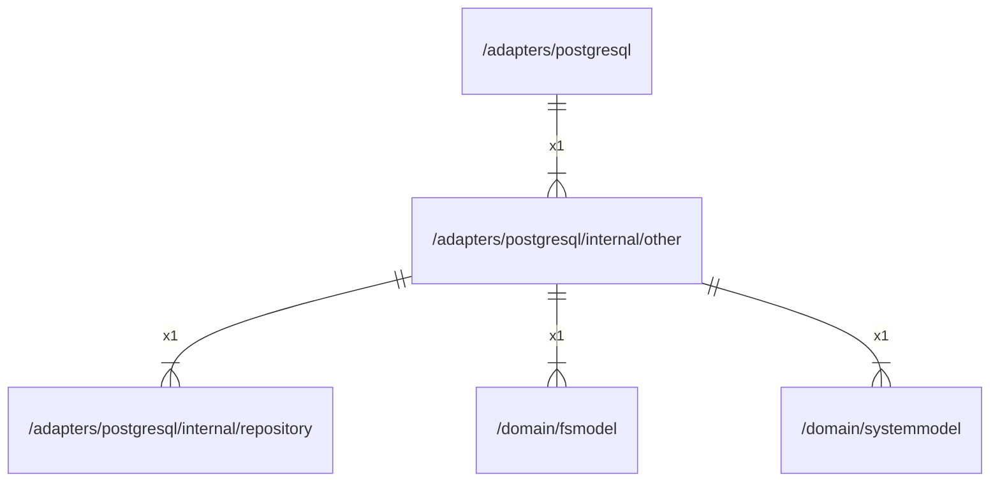

# other

## Imports

|    Name     |                           Path                            | Inner | Count |
|:-----------:|:---------------------------------------------------------:|:-----:|:-----:|
|   context   |                          context                          |  ❌   |   1   |
|     sql     |                       database/sql                        |  ❌   |   1   |
|     fmt     |                            fmt                            |  ❌   |   1   |
| repository  | [/adapters/postgresql/internal/repository](repository.md) |  ✅   |   1   |
|   fsmodel   |       [/domain/fsmodel](../../../domain/fsmodel.md)       |  ✅   |   1   |
| systemmodel |   [/domain/systemmodel](../../../domain/systemmodel.md)   |  ✅   |   1   |
|    uuid     |                  github.com/google/uuid                   |  ❌   |   1   |
|     v5      |                  github.com/jackc/pgx/v5                  |  ❌   |   1   |

## Used by

|    Name    |                    Path                     |
|:----------:|:-------------------------------------------:|
| postgresql | [/adapters/postgresql](../../postgresql.md) |

## Scheme

---

> Generated by [goArchLint](https://github.com/gbh007/goarchlint)
