# repository

## Imports

|   Name    |                Path                | Inner | Count |
|:---------:|:----------------------------------:|:-----:|:-----:|
|  context  |              context               |  ❌   |   3   |
|   slog    |              log/slog              |  ❌   |   3   |
|    fmt    |                fmt                 |  ❌   |   2   |
|   trace   |   go.opentelemetry.io/otel/trace   |  ❌   |   2   |
|   time    |                time                |  ❌   |   2   |
|    sql    |            database/sql            |  ❌   |   1   |
|   embed   |               embed                |  ❌   |   1   |
|    pkg    |      [/pkg](../../../pkg.md)       |  ✅   |   1   |
|    v5     |      github.com/jackc/pgx/v5       |  ❌   |   1   |
|  pgxpool  |  github.com/jackc/pgx/v5/pgxpool   |  ❌   |   1   |
|  stdlib   |   github.com/jackc/pgx/v5/stdlib   |  ❌   |   1   |
|    v3     |    github.com/pressly/goose/v3     |  ❌   |   1   |
| attribute | go.opentelemetry.io/otel/attribute |  ❌   |   1   |
|  regexp   |               regexp               |  ❌   |   1   |

## Used by

|    Name    |                          Path                           |
|:----------:|:-------------------------------------------------------:|
| postgresql |       [/adapters/postgresql](../../postgresql.md)       |
|   agent    |     [/adapters/postgresql/internal/agent](agent.md)     |
| attribute  | [/adapters/postgresql/internal/attribute](attribute.md) |
|    book    |      [/adapters/postgresql/internal/book](book.md)      |
|  deadhash  |  [/adapters/postgresql/internal/deadhash](deadhash.md)  |
|    file    |      [/adapters/postgresql/internal/file](file.md)      |
|   label    |     [/adapters/postgresql/internal/label](label.md)     |
|  massload  |  [/adapters/postgresql/internal/massload](massload.md)  |
|   other    |     [/adapters/postgresql/internal/other](other.md)     |
|    page    |      [/adapters/postgresql/internal/page](page.md)      |
| urlmirror  | [/adapters/postgresql/internal/urlmirror](urlmirror.md) |

## Scheme

```mermaid
erDiagram
    "/adapters/postgresql" ||--|{ "/adapters/postgresql/internal/repository" : x1
    "/adapters/postgresql/internal/agent" ||--|{ "/adapters/postgresql/internal/repository" : x1
    "/adapters/postgresql/internal/attribute" ||--|{ "/adapters/postgresql/internal/repository" : x1
    "/adapters/postgresql/internal/book" ||--|{ "/adapters/postgresql/internal/repository" : x1
    "/adapters/postgresql/internal/deadhash" ||--|{ "/adapters/postgresql/internal/repository" : x1
    "/adapters/postgresql/internal/file" ||--|{ "/adapters/postgresql/internal/repository" : x1
    "/adapters/postgresql/internal/label" ||--|{ "/adapters/postgresql/internal/repository" : x1
    "/adapters/postgresql/internal/massload" ||--|{ "/adapters/postgresql/internal/repository" : x1
    "/adapters/postgresql/internal/other" ||--|{ "/adapters/postgresql/internal/repository" : x1
    "/adapters/postgresql/internal/page" ||--|{ "/adapters/postgresql/internal/repository" : x1
    "/adapters/postgresql/internal/repository" ||--|{ "/pkg" : x1
    "/adapters/postgresql/internal/urlmirror" ||--|{ "/adapters/postgresql/internal/repository" : x1
```

---

> Generated by [goArchLint](https://github.com/gbh007/goarchlint)
